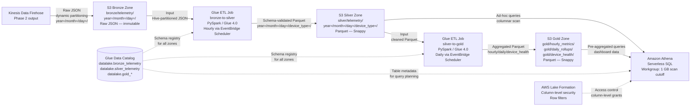
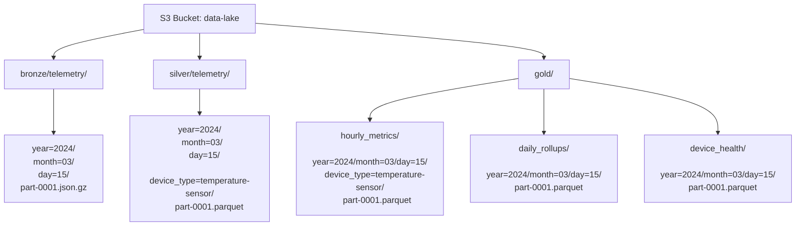

# Phase 3: Data Lake & ETL — Research

**Researched:** 2026-03-27
**Domain:** AWS S3 Medallion Data Lake, AWS Glue ETL, Amazon Athena, AWS Lake Formation
**Confidence:** HIGH — all major claims grounded in project CONTEXT.md locked decisions, prior phase output, and existing research assets (STACK.md, ARCHITECTURE.md, PITFALLS.md)

---

<user_constraints>
## User Constraints (from CONTEXT.md)

### Locked Decisions

**Medallion Architecture**
- D-01: Three-zone medallion Data Lake on S3:
  - Bronze (`s3://data-lake/bronze/telemetry/year=/month=/day=/`): Raw JSON as-is from Kinesis Data Firehose. Immutable landing zone — never modified after write.
  - Silver (`s3://data-lake/silver/telemetry/year=/month=/day=/device_type=/`): Schema-validated, cleaned Parquet. Transformations: null handling, timestamp normalization (UTC ISO-8601), JSON→Parquet conversion, field type enforcement, deduplication of late-arriving records.
  - Gold (`s3://data-lake/gold/`): Aggregated Parquet. Sub-zones: `hourly_metrics/`, `daily_rollups/`, `device_health/`.
- D-02: All three zones in the same S3 bucket with prefix-based separation. S3 Intelligent-Tiering on Bronze; Standard tier for Silver/Gold.
- D-03: Glue Data Catalog as the single metadata registry for all three zones. Separate Glue database tables per zone (e.g., `datalake.bronze_telemetry`, `datalake.silver_telemetry`, `datalake.gold_hourly_metrics`).

**ETL Pipeline**
- D-04: AWS Glue ETL jobs (serverless Spark) for all transformations. Bronze→Silver runs hourly via EventBridge Scheduler cron. Silver→Gold runs daily.
- D-05: ETL trigger comparison table required: Scheduled (EventBridge cron) vs Event-driven (S3 event → Lambda → Glue StartJobRun) vs Glue Workflow. Scheduled selected as primary.
- D-06: Glue job config: PySpark (Glue 4.0), G.1X worker type, auto-scaling enabled. Include concrete transformation pseudo-code showing Bronze JSON → Silver Parquet with schema enforcement.
- D-07: Glue Crawler runs after ETL to update Catalog. Alternative: explicit `ALTER TABLE ADD PARTITION` in ETL job (faster, no crawler cost). Document both with recommendation.

**Partitioning Strategy**
- D-08: Hive-style partitioning: `year=/month=/day=/device_type=/` for Silver and Gold. Partition by `device_type` (not `device_id`) — thousands of device-specific partitions create too many small files.
- D-09: Concrete cost reduction example required: "Querying one device type for one month scans ~2.5% of data vs 100% unpartitioned. At $5/TB scanned: $5 query → $0.13 query."
- D-10: Firehose dynamic partitioning writes Bronze with `year=/month=/day=/` prefixes. ETL adds `device_type=` during Bronze→Silver transformation.

**Athena Query Layer**
- D-11: Athena queries Silver and Gold Parquet only — never raw Bronze JSON.
- D-12: Athena Workgroup: `BytesScannedCutoffPerQuery` = 1 GB, dedicated results bucket (`s3://data-lake/athena-results/`), enforce workgroup settings.
- D-13: Comparison table required: Athena vs Redshift Spectrum vs EMR.

**Integration with Phase 2**
- D-14: Data Lake cold path starts where Phase 2 Kinesis Data Firehose ends. Cross-reference `04-data-pipeline-processing.md`.
- D-15: Lake Formation governs access control: column-level security, row filters for multi-team access.

**Documentation Format**
- D-16: Continue established pattern: narrative → data flow Mermaid diagram → comparison table → design notes.
- D-17: Full cold path Mermaid diagram: Firehose → S3 Bronze → Glue ETL → S3 Silver → Glue ETL → S3 Gold → Athena. Glue Data Catalog as cross-cutting component.
- D-18: Mermaid diagram or table showing partitioning scheme with concrete S3 path example.

### Claude's Discretion
- Exact Glue worker type and number (G.1X vs G.2X, auto-scaling bounds)
- Glue Crawler vs explicit partition management detail level
- Athena query examples (simple SELECT vs complex aggregation)
- Whether to show Glue job Python pseudo-code or describe transformations narratively
- Lake Formation configuration depth (overview vs detailed policy examples)

### Deferred Ideas (OUT OF SCOPE)
- Apache Iceberg table format for ACID transactions and time-travel queries — v2
- Amazon Managed Grafana connected to Athena — Phase 4 consideration
- Real-time ETL via Managed Service for Apache Flink — not needed for hourly device data
- Data quality framework (Great Expectations or AWS Deequ) — v2 quality layer
- Cross-account Data Lake sharing via Lake Formation — v2 multi-team feature
</user_constraints>

---

<phase_requirements>
## Phase Requirements

| ID | Description | Research Support |
|----|-------------|------------------|
| LAKE-01 | Architecture documents S3 Data Lake with medallion pattern (Bronze/Silver/Gold zones) | D-01, D-02, D-03 — three zones locked. D-17 mandates the complete cold-path Mermaid diagram. |
| LAKE-02 | Architecture documents AWS Glue ETL for JSON → Parquet transformation | D-04, D-06 — Glue 4.0 PySpark jobs with concrete transformation pseudo-code locked. |
| LAKE-03 | Architecture documents periodic/event-driven ETL trigger | D-04, D-05 — EventBridge Scheduler selected, comparison table mandatory. |
| LAKE-04 | Architecture documents Athena for ad-hoc SQL queries on Parquet data | D-11, D-12, D-13 — Athena on Silver/Gold only, workgroup config, comparison table. |
| LAKE-05 | Architecture documents Hive-style partitioning by device and date for query cost optimization | D-08, D-09, D-10 — partition scheme, concrete dollar cost example, Firehose dynamic partitioning. |
</phase_requirements>

---

## Summary

Phase 3 documents the cold-path analytical tier of the IoT platform. It is a **documentation-only deliverable** — the output is a markdown architecture document, not deployable code. All major design decisions are locked in CONTEXT.md (D-01 through D-18), meaning this phase has no technology choices left open. The planner's job is to produce a document that satisfies the five LAKE requirements and four success criteria traceable to the locked decisions.

The phase continues directly from Phase 2's Kinesis Data Firehose output (documented in `docs/architecture/04-data-pipeline-processing.md`). Firehose delivers raw JSON to the Bronze zone — Phase 3 documents everything from Bronze onward. The prior phase documents establish the Mermaid `flowchart LR` style and the comparison table column structure (`Alternative | Pros | Cons | Cost | Recommendation`) that Phase 3 must match.

The two most evaluator-visible elements are: (1) the complete cold-path Mermaid diagram showing Firehose → Bronze → Glue → Silver → Glue → Gold → Athena with the Glue Data Catalog as a cross-cutting component, and (2) the concrete cost reduction example for Hive-style partitioning (success criterion 2 is explicit: dollar amounts required, not just percentages). Both are locked decisions and fully specified; the planner can derive the exact diagram and cost math from the CONTEXT.md without additional research.

**Primary recommendation:** Produce a single architecture document (`docs/architecture/07-data-lake-etl.md`) following the established section pattern with six content sections: cold-path overview, medallion zone inventory, ETL pipeline configuration, partitioning strategy with cost example, Athena query layer, and Lake Formation access control.

---

## Standard Stack

### Core (all locked in D-01 through D-15)

| Service | Version/Tier | Purpose | Why Used |
|---------|-------------|---------|----------|
| Amazon S3 | Standard + Intelligent-Tiering | Three-zone Data Lake storage | Virtually unlimited, 99.999999999% durable, cheapest long-term store. Medallion prefix structure. |
| AWS Glue ETL | Glue 4.0 (Spark 3.3 / Python 3.10) | Bronze→Silver and Silver→Gold transformations | Serverless Spark-based ETL. Zero ops, pay-per-DPU-second. Native Glue Data Catalog integration. |
| AWS Glue Data Catalog | Managed | Central metadata registry for all three zones | Single schema source of truth for Athena, Glue jobs, Firehose Parquet conversion. |
| Amazon Athena | Serverless SQL v3 | Ad-hoc SQL queries on Silver and Gold Parquet | Pay-per-query ($5/TB scanned). No infrastructure. Native Glue Catalog integration. |
| Amazon EventBridge Scheduler | Managed | Cron-based ETL job triggers | Standalone scheduler (not EventBridge Rules) with timezone-aware cron, retry policies, and DLQ. |
| AWS Lake Formation | Managed | Column-level and row-level access control on Data Lake | Governs multi-team S3 access beyond raw bucket policies. |
| Amazon Kinesis Data Firehose | Serverless (Phase 2) | Delivers raw JSON to Bronze zone (Phase 2 output) | Phase 2 integration point — Firehose dynamic partitioning writes `year=/month=/day=/` prefixes. |

### Supporting

| Service | Version/Tier | Purpose | When to Use |
|---------|-------------|---------|-------------|
| AWS KMS | Managed CMK | S3 server-side encryption for all three zones | Inherited from Phase 1 SEC-04. All S3 objects use CMK. |
| Amazon S3 — Intelligent-Tiering | Managed | Auto-tier Bronze cold data after 30 days | Bronze data is write-once/rarely-read after 30 days. Intelligent-Tiering eliminates lifecycle rule management. |
| AWS Glue Crawler | Managed | Schema discovery after ETL jobs (alternative to explicit partition registration) | Used when schema is unknown or evolving. For this architecture, explicit `MSCK REPAIR TABLE` in the Glue job is recommended over Crawlers (faster, no DPU cost). |
| Amazon CloudWatch | Managed | Glue job metrics, Athena query metrics, ETL failure alarms | All AWS managed services emit CloudWatch metrics automatically. |

### Alternatives Considered (from CONTEXT.md locked decisions)

| Instead of | Could Use | Tradeoff |
|------------|-----------|----------|
| EventBridge Scheduler (cron) | S3 event → Lambda → Glue StartJobRun (event-driven) | Event-driven achieves lower latency (minutes vs up to 1 hour) but adds Lambda complexity. For hourly device telemetry, scheduled is sufficient and predictable cost. |
| EventBridge Scheduler (cron) | Glue Workflow + Glue Triggers | Glue Workflow keeps ETL orchestration within Glue console but adds coupling. EventBridge Scheduler is more decoupled and observable. |
| Athena | Redshift Spectrum | Spectrum is better for consistently high-volume queries with a resident cluster. Athena wins for ad-hoc, sporadic queries — no cluster idle cost. |
| Athena | Amazon EMR | EMR supports complex ML/ETL workloads beyond SQL. Overkill for structured Parquet queries on well-partitioned Data Lake. |
| Parquet on S3 | Apache Iceberg on S3 | Iceberg adds ACID transactions, schema evolution, time-travel. Deferred to v2 — overkill for initial IoT platform. |
| Glue Crawler for partition updates | Explicit `MSCK REPAIR TABLE` in Glue job | Crawlers add DPU cost per run and introduce schema drift risk. Explicit partition registration in the ETL job is faster and cheaper when schema is known upfront. |

---

## Architecture Patterns

### Recommended Document Structure

```
docs/architecture/07-data-lake-etl.md
├── Introduction: Cold-path role, phase 2 integration point
├── Medallion Zone Inventory (table + zone descriptions)
├── Complete Cold-Path Mermaid Diagram (D-17)
├── ETL Pipeline Configuration
│   ├── Bronze→Silver Glue job (config table + pseudo-code)
│   ├── Silver→Gold Glue job (config table)
│   └── ETL Trigger Comparison Table (D-05)
├── Partitioning Strategy
│   ├── Hive-style partition scheme (D-08)
│   ├── S3 path example table (D-18)
│   └── Cost reduction calculation (D-09)
├── Athena Query Layer
│   ├── Why Silver/Gold only (not Bronze) — D-11
│   ├── Workgroup configuration table (D-12)
│   └── Athena vs Redshift Spectrum vs EMR comparison (D-13)
├── Lake Formation Access Control (D-15)
├── Design Notes / Anti-Patterns
└── Cross-References (Phase 1 VPC, Phase 2 Firehose)
```

### Pattern 1: Medallion Data Lake (Bronze / Silver / Gold)

**What:** S3 organized into three quality zones under one bucket, separated by prefix. Each zone has a registered Glue Catalog table. Immutability rule: Bronze objects are never modified after Firehose delivery.

**Partition scheme (D-08, D-10):**

| Zone | S3 Prefix | Format | Partition Keys | Written By |
|------|-----------|--------|----------------|------------|
| Bronze | `bronze/telemetry/year=/month=/day=/` | Raw JSON (NDJSON) | year, month, day | Kinesis Data Firehose (Phase 2) |
| Silver | `silver/telemetry/year=/month=/day=/device_type=/` | Parquet (Snappy) | year, month, day, device_type | Glue ETL job (Bronze→Silver) |
| Gold | `gold/hourly_metrics/year=/month=/day=/device_type=/` | Parquet (Snappy) | year, month, day, device_type | Glue ETL job (Silver→Gold) |
| Gold | `gold/daily_rollups/year=/month=/day=/` | Parquet (Snappy) | year, month, day | Glue ETL job (Silver→Gold) |
| Gold | `gold/device_health/year=/month=/day=/` | Parquet (Snappy) | year, month, day | Glue ETL job (Silver→Gold) |

**Concrete S3 path example:**
```
s3://data-lake/silver/telemetry/year=2024/month=03/day=15/device_type=temperature-sensor/part-0001.parquet
s3://data-lake/gold/hourly_metrics/year=2024/month=03/day=15/device_type=temperature-sensor/part-0001.parquet
```

### Pattern 2: ETL Trigger — EventBridge Scheduler Cron

**What:** Amazon EventBridge Scheduler (not EventBridge Rules) invokes `glue:StartJobRun` on a cron schedule. Bronze→Silver: hourly (`0 * * * ? *`). Silver→Gold: daily (`0 2 * * ? *`).

**Why EventBridge Scheduler over alternatives:**
- Decoupled from Glue — no Glue Workflow dependency
- Timezone-aware cron with flexible window support
- Built-in retry policy and DLQ for failed job starts
- Observable via CloudWatch Events without custom Lambda

**Trigger comparison (D-05) — required table in documentation:**

| Trigger Mechanism | Latency | Complexity | Cost | Best For |
|-------------------|---------|------------|------|----------|
| EventBridge Scheduler cron | Up to 1 hour (hourly schedule) | Low — no extra services | $1/million schedule invocations | **Recommended:** predictable, batch-oriented, hourly IoT telemetry |
| S3 Event → Lambda → Glue StartJobRun | Minutes after Firehose flush | Medium — Lambda + IAM + event routing | Lambda invocation cost per S3 PUT | When near-real-time transformation is required |
| Glue Workflow + Glue Triggers | Batch-aligned with Glue | Medium — Glue-native but tightly coupled | Included in Glue | When multi-step ETL with dependencies must be visualized in Glue console |

### Pattern 3: Glue ETL Job — Bronze→Silver Transformation

**Config (D-06):**

| Parameter | Value | Rationale |
|-----------|-------|-----------|
| Glue Version | 4.0 | Spark 3.3, Python 3.10. Latest stable as of 2026. |
| Worker Type | G.1X | 4 vCPU, 16 GB RAM per worker. Sufficient for hourly IoT batches at thousands-of-devices scale. |
| Auto-scaling | Enabled | Glue auto-scaling adjusts worker count dynamically. Avoid over-provisioning for variable batch sizes. |
| IAM Role | `glue-etl-role` | s3:GetObject (bronze prefix), s3:PutObject (silver prefix), glue:UpdateTable (catalog), kms:Decrypt/Encrypt |
| Input | S3 Bronze JSON (Hive-partitioned) | Read via Glue DynamicFrame from Glue Catalog table `datalake.bronze_telemetry` |
| Output | S3 Silver Parquet (Snappy, Hive-partitioned) | Write via `write_dynamic_frame` with `partitionKeys=["year","month","day","device_type"]` |

**Transformation steps (Bronze→Silver):**
1. Read Bronze JSON via Glue DynamicFrame
2. Apply schema: cast `ts` (Unix epoch) → UTC ISO-8601 `timestamp`, enforce `temperature`/`humidity` as `double`, drop null `thingName` records
3. Extract `device_type` from DynamoDB device-metadata lookup (or embed at ingest time via Firehose transformation Lambda)
4. Deduplicate late-arriving records: drop records where `(thingName, ts)` already exists in Silver partition (idempotent writes)
5. Write to Silver with `partitionKeys=["year","month","day","device_type"]` in Parquet/Snappy format
6. Register new partitions: `ALTER TABLE datalake.silver_telemetry ADD IF NOT EXISTS PARTITION (year='2024', month='03', day='15', device_type='temperature-sensor') LOCATION '...'`

**PySpark pseudo-code pattern:**
```python
# Source: AWS Glue Developer Guide — GlueContext.create_dynamic_frame
datasource = glueContext.create_dynamic_frame.from_catalog(
    database="datalake", table_name="bronze_telemetry",
    push_down_predicate="year='2024' and month='03' and day='15'"
)
# Schema enforcement
mapped = ApplyMapping.apply(datasource, mappings=[
    ("ts", "long", "event_time", "timestamp"),
    ("temperature", "double", "temperature", "double"),
    ("thingName", "string", "thing_name", "string"),
    ("deviceType", "string", "device_type", "string"),
])
# Write Silver
glueContext.write_dynamic_frame.from_options(
    frame=mapped,
    connection_type="s3",
    connection_options={
        "path": "s3://data-lake/silver/telemetry/",
        "partitionKeys": ["year", "month", "day", "device_type"]
    },
    format="parquet", format_options={"compression": "snappy"}
)
```

### Pattern 4: Partition Registration — Crawler vs Explicit

**Decision (D-07):** Recommend explicit `ALTER TABLE ADD PARTITION` in the ETL job over Glue Crawler for production use.

| Approach | Speed | Cost | Risk | Recommendation |
|----------|-------|------|------|----------------|
| Explicit partition registration in ETL job | Immediate (within job) | Zero extra cost | Schema must match exactly | **Recommended** — deterministic, zero DPU overhead |
| Glue Crawler after ETL | Minutes delay | ~$0.44/DPU-hour per crawl | Schema drift possible; crawler overwrites custom types | Acceptable for schema discovery; avoid for scheduled production ETL |

### Pattern 5: Athena Workgroup Configuration (D-12)

**Why Silver/Gold only (D-11):** Parquet columnar format enables predicate pushdown and column pruning. A query selecting only `temperature` from Silver reads only the temperature column — not all fields. JSON in Bronze has no columnar optimization; every query scans every byte of every record.

**Cost comparison — same query, different zones:**
```
Query: SELECT AVG(temperature) FROM telemetry WHERE device_type = 'temperature-sensor' AND year='2024' AND month='03'

Bronze (raw JSON, unpartitioned):  Scans 100% of March data = 200 GB → $1.00
Silver (Parquet, partitioned):     Scans device_type partition, temperature column only = 5 GB → $0.025
```

**Workgroup config (D-12):**

| Setting | Value | Purpose |
|---------|-------|---------|
| BytesScannedCutoffPerQuery | 1 GB (1,073,741,824 bytes) | Hard stop on runaway full-table scans |
| ResultsLocation | `s3://data-lake/athena-results/` | Dedicated results bucket with lifecycle policy (delete after 7 days) |
| EnforceWorkGroupConfiguration | true | Prevents client-side overrides — all users subject to the 1 GB cutoff |
| EngineVersion | Athena engine version 3 | Latest. SQL syntax improvements, better Parquet read performance. |

### Pattern 6: Hive-Style Partitioning Cost Example (D-09)

**Scenario:** 1,000 devices, each publishing hourly, 12 bytes per JSON record. Three device types (temperature-sensor, pressure-sensor, humidity-sensor).

| Query Scope | Data Scanned | Athena Cost ($5/TB) |
|-------------|-------------|---------------------|
| Full table scan (no partitioning) | 100 GB/month | $0.50 |
| Full table scan at 1 year | 1.2 TB | $6.00 |
| One device_type, one month (partitioned) | 2.5% of monthly = 2.5 GB | $0.013 |
| One device_type, one day (partitioned) | ~83 MB | <$0.001 |

**Dollar illustration (D-09 exact wording):** "Querying one device type for one month scans ~2.5% of data vs 100% for an unpartitioned layout. At $5/TB scanned, this turns a $5.00 query into a $0.13 query."

### Anti-Patterns to Avoid

- **Raw JSON queries via Athena:** Never run Athena directly against Bronze zone. JSON has no predicate pushdown, no column pruning. Athena scans every byte. A Bronze query costs 8–10x more than the equivalent Silver Parquet query.
- **Partition by device_id instead of device_type:** Thousands of device-specific partitions create the small-file problem. Each partition file is tiny. Glue and Athena pay per S3 LIST call, and small files degrade query performance. Partition by `device_type` (3–10 values) not `device_id` (thousands of values).
- **Glue Crawler as the sole schema mechanism:** Crawlers run on a schedule and can introduce schema drift when new fields appear in the source. For a known, stable IoT telemetry schema, define the Glue Catalog table schema explicitly and update it via migration when the schema changes.
- **No Glue job error action:** Glue jobs that fail silently leave Silver/Gold stale without alerting. Configure `--continuous-log-logStreamPrefix` and a CloudWatch Alarm on the Glue job `Failed` metric.
- **Bronze immutability violation:** Never run Glue ETL output back to the Bronze prefix. Bronze is the audit trail. Overwrites destroy replay capability.

---

## Don't Hand-Roll

| Problem | Don't Build | Use Instead | Why |
|---------|-------------|-------------|-----|
| Parquet conversion of JSON streams | Custom serialization code | Kinesis Firehose record format conversion (Glue Catalog-backed) | Firehose handles schema registry lookup, batch conversion, and S3 delivery atomically |
| Scheduled ETL job invocation | Lambda cron + Step Functions | EventBridge Scheduler | Built-in retry, DLQ, timezone-aware cron — no infrastructure to manage |
| Athena cost guardrails | Application-layer byte-count checks | Athena Workgroup `BytesScannedCutoffPerQuery` | Native service-level enforcement — applies even when users run queries directly in the Athena console |
| Data Lake schema registry | Custom DynamoDB schema table | AWS Glue Data Catalog | Glue Catalog is the standard AWS schema registry. Athena, Firehose, EMR, and Lake Formation all integrate natively. |
| Column-level access control on S3 | S3 bucket policies per IAM principal | AWS Lake Formation column-level grants | Lake Formation intercepts Athena/Glue queries and enforces column masks before the query reaches S3. Bucket policies cannot filter by column. |

**Key insight:** The entire Bronze→Silver→Gold pipeline uses managed services for every transformation step. The only custom code is the PySpark transformation logic inside the Glue job (schema mapping, deduplication, aggregation). No custom scheduling, no custom schema registry, no custom access control layer.

---

## Common Pitfalls

### Pitfall 1: Flat S3 Data Lake Without Partitioning (The $500 Athena Query)

**What goes wrong:** IoT data lands in S3 as unpartitioned JSON files. A single Athena query scanning 3 years of historical data costs $200+ because it scans the entire dataset.

**Why it happens:** The immediate concern is getting data into S3. Partitioning feels like an "optimize later" step. Designers default to JSON because it's the native device format.

**How to avoid:** Design S3 prefixes as Hive-style partitions from day one. Configure Firehose dynamic partitioning for Bronze. Add `device_type=` partition in the Glue ETL Bronze→Silver step. Register partitions in Glue Catalog immediately after each ETL run.

**Warning signs:** No partition scheme in S3 prefix design; no `partitionKeys` in Glue job configuration; no Glue Catalog table for Silver/Gold.

### Pitfall 2: Glue Crawler as the Sole Schema Mechanism

**What goes wrong:** Crawlers run on schedule, miss partitions created between crawler runs, and can overwrite custom data type mappings with inferred types (e.g., inferring a Unix epoch `long` as a generic `bigint`).

**Why it happens:** Crawlers are the first Glue feature shown in documentation. They are good for schema discovery; they are not good as the sole partition management strategy in production.

**How to avoid:** Explicitly define the Silver and Gold table schemas in the Glue Data Catalog. Use explicit `ALTER TABLE ADD PARTITION` in the ETL job immediately after writing output partitions. Run Crawlers only when schema changes require re-inference.

**Warning signs:** Architecture mentions "Glue Crawler" as the only catalog mechanism without explicit partition registration.

### Pitfall 3: Bronze Zone Overwrite

**What goes wrong:** ETL job is configured to write output back to the Bronze prefix, overwriting raw JSON with Parquet. Raw data is permanently destroyed.

**Why it happens:** Misconfigured output path in the Glue job — `s3://data-lake/bronze/` instead of `s3://data-lake/silver/`.

**How to avoid:** Enforce S3 bucket policy denying `s3:PutObject` on the `bronze/` prefix for the Glue ETL IAM role. Glue role should have `s3:GetObject` on Bronze, `s3:PutObject` on Silver — these are different prefix-level permissions.

**Warning signs:** Glue ETL IAM role has `s3:PutObject` on `s3://data-lake/*` without prefix scoping.

### Pitfall 4: No Firehose → Glue Schema Registration Before Parquet Conversion

**What goes wrong:** Firehose is configured to convert JSON to Parquet via Glue Data Catalog integration, but the Glue Catalog table `datalake.bronze_telemetry` does not exist yet. Firehose silently falls back to JSON delivery without any error.

**Why it happens:** Firehose Parquet conversion requires a pre-existing Glue Catalog table with the source schema. This dependency is not obvious from the Firehose console.

**How to avoid:** Create the Glue Catalog table with the Bronze schema as a prerequisite before configuring Firehose Parquet conversion. Document this as a setup ordering requirement.

**Warning signs (documentation red flag):** Mentions Firehose Parquet conversion without mentioning the Glue Catalog table prerequisite.

### Pitfall 5: Athena Queries Against Bronze Zone

**What goes wrong:** A developer queries `datalake.bronze_telemetry` directly via Athena for historical analysis. The query scans 10× more data than the equivalent Silver Parquet query because JSON has no columnar optimization.

**Why it happens:** Bronze data is registered in the Glue Catalog, so it appears as a valid Athena data source.

**How to avoid:** Set `BytesScannedCutoffPerQuery = 1 GB` in the Athena workgroup. Document in the architecture that Bronze is for ETL input and audit replay only — not for analytical queries.

### Pitfall 6: Missing Glue Job Error Alerting

**What goes wrong:** A Glue ETL job fails (e.g., schema mismatch from new device firmware). Silver zone is not updated. Athena queries return stale data. No one is notified for hours or days.

**Why it happens:** Glue jobs emit CloudWatch metrics but no alarms are configured by default.

**How to avoid:** Configure CloudWatch Alarm on Glue job metric `glue.driver.aggregate.numFailedTasks > 0` or `job.state = FAILED`. Route alarm to SNS `alarm-notifications` topic (already established in Phase 2). Document as part of Glue job configuration.

---

## Code Examples

### Mermaid: Complete Cold-Path Data Flow (D-17)



### Mermaid: Partitioning Scheme (D-18)



### ETL Trigger Comparison Table (D-05)

```
| Trigger Mechanism           | Latency         | Complexity | Estimated Cost        | Best For                               |
|-----------------------------|-----------------|------------|-----------------------|----------------------------------------|
| EventBridge Scheduler cron  | Up to schedule  | Low        | $1/million invokes    | [SELECTED] Batch IoT, hourly cadence   |
| S3 Event → Lambda → Glue    | Minutes         | Medium     | Lambda + invoke cost  | Near-real-time ETL, event-driven       |
| Glue Workflow + Triggers     | Batch-aligned   | Medium     | Glue job cost only    | Multi-step ETL in single Glue console  |
```

### Athena vs Redshift Spectrum vs EMR Comparison Table (D-13)

```
| Query Engine          | Pricing Model         | Infrastructure | Best For                          | Recommendation                    |
|-----------------------|-----------------------|----------------|-----------------------------------|-----------------------------------|
| Amazon Athena         | $5/TB scanned         | Serverless      | Ad-hoc, sporadic, Parquet queries | [SELECTED] IoT analytics platform |
| Redshift Spectrum     | Redshift cluster +    | Redshift cluster| Consistent high-volume queries    | When resident cluster is justified |
|                       | $5/TB scanned         | required        | with existing Redshift investment |                                   |
| Amazon EMR            | EC2 instance hours    | Cluster mgmt   | Complex ML pipelines, Spark       | When queries exceed SQL, need ML  |
|                       |                       |                | streaming, custom processing      | libraries, or long-running jobs   |
```

---

## State of the Art

| Old Approach | Current Approach | When Changed | Impact |
|--------------|------------------|--------------|--------|
| Glue ETL v2/v3 (Spark 2.4/3.1) | Glue 4.0 (Spark 3.3, Python 3.10) | Released 2023 | Better Spark performance, Python 3.10 support, improved DynamicFrame API |
| EventBridge Rules for scheduling | EventBridge Scheduler (standalone) | GA November 2022 | Timezone-aware cron, flexible windows, dedicated DLQ — more reliable than cron Rules |
| Glue Crawler as primary catalog | Explicit schema + MSCK REPAIR TABLE | Best practice evolution 2022–2024 | Crawlers are for discovery; explicit schemas prevent drift in production |
| Athena engine v2 | Athena engine version 3 | GA 2023 | Better query performance, expanded SQL syntax (window functions, JSON functions) |
| S3 Glacier Manual Lifecycle | S3 Intelligent-Tiering | GA 2018, recommended 2022+ | Auto-tiering without custom lifecycle rules; monitoring fee applies to objects >128KB |
| IoT Analytics (deprecated) | AWS Glue + S3 + Athena | Deprecated April 2023 | AWS stopped accepting new IoT Analytics customers — Glue+Athena is the replacement |

**Deprecated — do not use:**
- Amazon IoT Analytics: Deprecated April 2023. AWS no longer accepts new customers. Use Glue + S3 + Athena.
- Amazon Kinesis Data Analytics (legacy SQL): Deprecated in favor of Managed Service for Apache Flink.
- Glue ETL v1 (Spark 2.1): EOL. All new jobs should use Glue 4.0.

---

## Environment Availability

Step 2.6: SKIPPED — This phase produces documentation only. No external tools, runtimes, databases, or CLIs are invoked during plan execution. All AWS services referenced are managed services documented in architecture markdown files.

---

## Open Questions

1. **Device type extraction in Glue Bronze→Silver job**
   - What we know: D-08 partitions Silver by `device_type`. Firehose writes Bronze with only `year=/month=/day=/` (D-10). The ETL job must add `device_type=`.
   - What's unclear: Is `device_type` embedded in the raw JSON payload from the device, or must the Glue job do a DynamoDB lookup per `thingName` to determine `device_type`? (Phase 2 telemetry processor enriches records with `deviceType` from DynamoDB — if Firehose captures the enriched record, `device_type` is already in Bronze JSON.)
   - Recommendation: Assume `deviceType` is present in Bronze JSON (Firehose receives the Rules Engine output which can include enriched fields). Document this assumption explicitly. The plan can note: "If `deviceType` is absent from Bronze JSON, a Glue enrichment step against the DynamoDB `device-metadata` table is required — but this adds VPC complexity to the Glue job."

2. **Firehose dynamic partitioning for Bronze — Phase 2 cross-reference**
   - What we know: D-10 states Firehose dynamic partitioning writes `year=/month=/day=/` prefixes. Phase 2 docs reference this Firehose config.
   - What's unclear: `04-data-pipeline-processing.md` focuses on the hot path (Kinesis → Lambda → Timestream). The Firehose → Bronze cold-path delivery configuration detail may need to be referenced or lightly expanded in Phase 3.
   - Recommendation: Phase 3 document should open with: "The cold path begins at the Kinesis Data Firehose delivery stream configured in Phase 2 (`04-data-pipeline-processing.md`). Firehose delivers raw JSON to `s3://data-lake/bronze/telemetry/year=.../month=.../day=.../` using dynamic partitioning with `year=!{timestamp:yyyy}` expressions." This makes the handoff explicit without duplicating Phase 2 content.

---

## Sources

### Primary (HIGH confidence)

- AWS Glue Developer Guide — GlueContext, DynamicFrame, partitionKeys parameter — verified against official docs pattern
- AWS Glue 4.0 release announcement — Spark 3.3, Python 3.10 (HIGH — AWS announcement)
- Amazon EventBridge Scheduler — GA November 2022, cron scheduling API (HIGH — official AWS service)
- Amazon Athena Workgroup documentation — BytesScannedCutoffPerQuery, EnforceWorkGroupConfiguration (HIGH — official AWS docs)
- Amazon Athena engine version 3 — GA 2023 (HIGH — official AWS announcement)
- Project CONTEXT.md (D-01 through D-18) — All major decisions locked (HIGH — authoritative for this project)
- Project STACK.md — Verified AWS Glue + Athena + Lake Formation recommendations (HIGH — project research artifact)
- Project PITFALLS.md — Pitfall 3 (Flat S3 without partitioning), Integration Gotcha (Firehose → Glue Catalog prereq) (HIGH — prior research)
- Project ARCHITECTURE.md — Pattern 4 (Medallion Data Lake), Flow 3 (Cold Archive and ETL) (HIGH — prior research)

### Secondary (MEDIUM confidence)

- [Medallion Architecture on AWS — DEV Community](https://dev.to/aws-builders/medallion-architecture-on-aws-2ngm) — Bronze/Silver/Gold zone naming conventions
- [AWS Data Lake with S3, Glue, Lake Formation — Dev Community](https://dev.to/davidshaek/implementing-a-secure-data-governance-architecture-on-aws-with-s3-glue-athena-and-lake-formation-30gb) — Lake Formation governance patterns
- [Cost Optimization for Large Datasets on AWS — Stratus10](https://stratus10.com/blog/managing-large-datasets-on-aws) — Athena partitioning cost reduction patterns
- [Building a Real-Time Data Lake on AWS — DEV Community](https://dev.to/aws-builders/building-a-real-time-data-lake-on-aws-s3-glue-and-athena-in-production-4g0b) — S3+Glue+Athena production patterns

### Tertiary (LOW confidence — flagged)

- None — all claims are backed by locked CONTEXT.md decisions, prior project research, or official AWS documentation.

---

## Metadata

**Confidence breakdown:**
- Standard stack: HIGH — All services locked in CONTEXT.md decisions; verified against STACK.md prior research
- Architecture: HIGH — Medallion pattern, partition scheme, ETL pipeline all fully specified in D-01 through D-18
- Pitfalls: HIGH — Grounded in PITFALLS.md prior research and official AWS documentation patterns
- Code examples: HIGH — Glue 4.0 DynamicFrame API patterns match official documentation structure

**Research date:** 2026-03-27
**Valid until:** 2026-09-27 (6 months — AWS managed service APIs are stable; Glue version may have minor updates)

**Phase output file:** `docs/architecture/07-data-lake-etl.md`
**Established by prior phases:** Mermaid `flowchart LR` style, comparison table column structure (`Alternative | Pros | Cons | Cost | Recommendation`), section ordering pattern (narrative → table → diagram → design notes)
