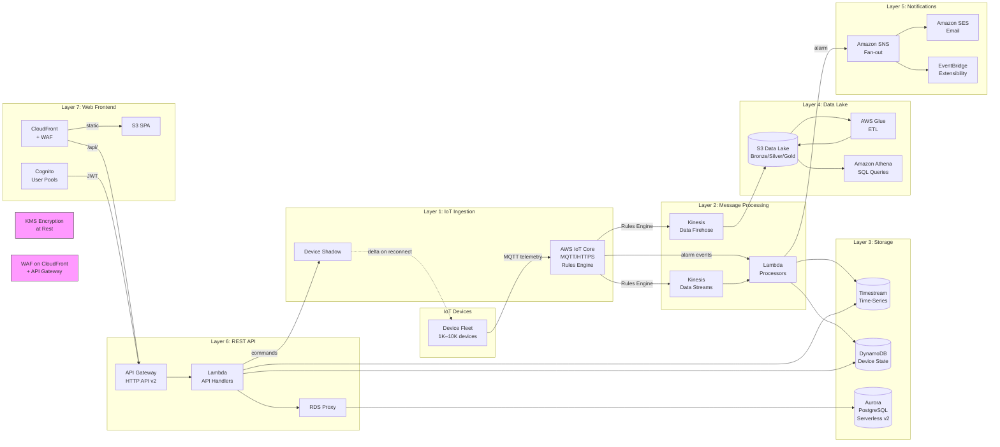

<objective>
Create the synthesis documents: top-level overview diagram with three key-flow sequence diagrams (10-overview-and-sequences.md), cost analysis with per-service breakdown and optimization strategies (11-cost-analysis.md), and README index file linking all 11 architecture documents.

Purpose: Completes the architecture deliverable with cross-cutting quality artifacts that tie all layers together and demonstrate cost awareness to evaluators.
Output: docs/architecture/10-overview-and-sequences.md, docs/architecture/11-cost-analysis.md, docs/architecture/README.md
</objective>

<execution_context>
@$HOME/.claude/get-shit-done/workflows/execute-plan.md
@$HOME/.claude/get-shit-done/templates/summary.md
</execution_context>

<context>
@.planning/PROJECT.md
@.planning/ROADMAP.md
@.planning/STATE.md
@.planning/phases/04-api-web-frontend-documentation-quality/04-CONTEXT.md
@.planning/phases/04-api-web-frontend-documentation-quality/04-RESEARCH.md
@.planning/phases/04-api-web-frontend-documentation-quality/04-01-SUMMARY.md
@.planning/phases/04-api-web-frontend-documentation-quality/04-02-SUMMARY.md
</context>

<tasks>

<task type="auto">
  <name>Task 1: Create Overview Diagram and Sequence Diagrams Document</name>
  <files>docs/architecture/10-overview-and-sequences.md</files>
  <read_first>
    - docs/architecture/01-security-foundation.md (VPC topology, WAF — for overlay annotations in overview)
    - docs/architecture/02-device-connectivity-ingestion.md (IoT Core, Rules Engine, topic namespace — for telemetry sequence)
    - docs/architecture/03-device-management.md (Device Shadow sequence — for command delivery sequence, use exact participant names)
    - docs/architecture/04-data-pipeline-processing.md (Kinesis, Lambda processor — for telemetry sequence)
    - docs/architecture/05-storage-layer.md (Timestream, DynamoDB, Aurora — for overview and sequences)
    - docs/architecture/06-alarm-notifications.md (SNS, EventBridge, SES, dedup — for alarm sequence)
    - docs/architecture/07-data-lake-etl.md (Medallion S3, Glue, Athena — for overview diagram; VERIFY that ETL trigger and query engine comparison tables exist per D-14 audit)
    - docs/architecture/08-api-layer.md (API Gateway, Cognito, Lambda handlers — for API layer in overview and command sequence)
    - docs/architecture/09-web-frontend.md (CloudFront, S3, OAC — for web frontend layer in overview)
    - .planning/phases/04-api-web-frontend-documentation-quality/04-CONTEXT.md (locked decisions D-09 through D-15)
    - .planning/phases/04-api-web-frontend-documentation-quality/04-RESEARCH.md (overview diagram layer ordering, sequence diagram participants, anti-patterns on diagram size)
  </read_first>
  <action>
Create `docs/architecture/10-overview-and-sequences.md`. This is the synthesis capstone document. Structure:

**1. Introduction (## Architecture Overview):** Brief statement: "This document provides the 30,000-foot view of the IoT monitoring platform architecture, followed by end-to-end sequence diagrams for the three key operational flows. Each component is documented in detail in its per-layer document (01–09). This overview shows how all layers connect."

**2. Top-Level Overview Mermaid Diagram (### System Architecture Overview):** Per D-09 and D-10, create ONE `flowchart LR` diagram with `subgraph` blocks per layer. CRITICAL: Keep to service-level nodes only (max 20-25 nodes). Do NOT include every Lambda function or DynamoDB table — those live in per-layer diagrams. Use this exact layer structure from RESEARCH.md:



**IMPORTANT:** If the Mermaid source exceeds ~60 lines, it is too detailed. Remove nodes or simplify. The overview must be readable when rendered.

Below the diagram, add a cross-reference table:

| Layer | Per-Layer Document | Key Components |
|-------|-------------------|----------------|
| IoT Ingestion | 02-device-connectivity-ingestion.md | IoT Core, Rules Engine, Basic Ingest |
| Device Management | 03-device-management.md | Device Shadow, Fleet Provisioning |
| Message Processing | 04-data-pipeline-processing.md | Kinesis Data Streams, Lambda batch consumer |
| Storage | 05-storage-layer.md | Timestream, DynamoDB, Aurora Serverless v2 |
| Alarm Notifications | 06-alarm-notifications.md | SNS, SES, EventBridge, deduplication |
| Data Lake & ETL | 07-data-lake-etl.md | S3 Medallion, Glue ETL, Athena |
| REST API | 08-api-layer.md | API Gateway HTTP API v2, Cognito, Lambda |
| Web Frontend | 09-web-frontend.md | CloudFront, S3 OAC, SPA |
| Security Foundation | 01-security-foundation.md | VPC, IAM, KMS, WAF |

**3. Sequence Diagram 1: Telemetry Ingestion End-to-End (### Telemetry Ingestion Flow):** Per D-12 item 1. Create a `sequenceDiagram` with participants:
- Device, IoT Core, Rules Engine, Kinesis Data Streams, Kinesis Firehose, Lambda (telemetry-processor), Timestream, DynamoDB, S3 Bronze

Key steps:
1. Device publishes JSON to `devices/{thingName}/telemetry` (MQTT)
2. IoT Core receives and applies TelemetryRule (Rules Engine SQL: `SELECT * FROM 'devices/+/telemetry'`)
3. Rules Engine fan-out: forwards to Kinesis Data Streams (hot path) AND Kinesis Firehose (cold path)
4. Kinesis Data Streams batches records (batch size 100-500)
5. Lambda (telemetry-processor) invoked with batch
6. Lambda writes to Timestream (time-series insert) and DynamoDB (latest-value cache update)
7. Kinesis Firehose buffers and delivers raw JSON to S3 Bronze (`s3://datalake/bronze/year=/month=/day=/`)
8. Note: "Glue ETL transforms Bronze → Silver (Parquet) → Gold (aggregated) on schedule — see 07-data-lake-etl.md"

Cross-reference: "See 02-device-connectivity-ingestion.md for IoT Core and Rules Engine. See 04-data-pipeline-processing.md for Kinesis and Lambda processing. See 05-storage-layer.md for Timestream and DynamoDB. See 07-data-lake-etl.md for the Data Lake cold path."

**4. Sequence Diagram 2: Alarm Notification Pipeline (### Alarm Notification Flow):** Per D-12 item 2. Create a `sequenceDiagram` with participants:
- Device, IoT Core, Rules Engine, Lambda (alarm-evaluator), DynamoDB (dedup), Aurora (RDS Proxy), SNS, Lambda (ses-sender), SES, EventBridge

Key steps:
1. Device publishes to `devices/{thingName}/alarm` with threshold breach data
2. IoT Core AlarmRule: `SELECT * FROM 'devices/+/alarm' WHERE value > threshold`
3. Rules Engine invokes Lambda (alarm-evaluator) asynchronously
4. Lambda checks device context in Aurora via RDS Proxy (alert rules, device group)
5. Lambda performs DynamoDB conditional write for deduplication (attribute_not_exists with 15-min TTL)
6. If new alarm (conditional write succeeds): Lambda publishes to SNS `alarm-notifications` topic
7. SNS fans out to Lambda (ses-sender) subscription
8. Lambda (ses-sender) sends formatted alarm email via SES
9. EventBridge receives alarm event on `iot-alarm-bus` for future extensibility (Slack, PagerDuty)
10. If duplicate (conditional write fails): Lambda logs and exits (alarm already notified within 15-min window)
11. Note: "On Lambda failure, DestinationConfig.OnFailure routes to SQS DLQ — no silent data loss"

Cross-reference: "See 02-device-connectivity-ingestion.md for IoT Rules Engine. See 06-alarm-notifications.md for the full alarm pipeline, deduplication strategy, and EventBridge extensibility."

**5. Sequence Diagram 3: Web-to-Device Command Delivery (### Command Delivery Flow):** Per D-12 item 3. Create a `sequenceDiagram` showing the FULL end-to-end. NOTE: doc 09 already has a version of this — use the SAME participant names and flow but ensure this version in doc 10 is the canonical cross-cutting reference:
- Browser (Operator), Cognito, API Gateway, Lambda (command-handler), IoT Device Shadow, DynamoDB (audit), Device

Key steps (same as doc 09 web-to-device flow):
1. Browser already authenticated via Cognito (note reference to 08-api-layer.md auth flow)
2. POST /devices/{thingName}/commands with JWT
3. API Gateway JWT authorizer validates
4. Lambda updates Device Shadow desired state
5. Lambda logs to DynamoDB audit
6. 202 Accepted returned
7. Device reconnects hourly, receives delta, applies command, reports back
8. Delta cleared when desired == reported

Cross-reference: "See 08-api-layer.md for Cognito authentication and API Gateway configuration. See 03-device-management.md for the Device Shadow delta mechanism. See 09-web-frontend.md for the SPA hosting architecture."

**6. Comparison Table Audit (### Technology Decision Summary):** Per D-14 and D-15, create an audit table listing ALL comparison tables across the architecture:

| Decision | Alternatives Compared | Recommendation | Document |
|----------|----------------------|----------------|----------|
| IoT Entry Point | IoT Core vs SiteWise vs self-managed MQTT | IoT Core | 02-device-connectivity-ingestion.md |
| Stream Buffer | Kinesis vs MSK vs SQS | Kinesis Data Streams | 04-data-pipeline-processing.md |
| Time-Series Store | Timestream vs DynamoDB-TS vs InfluxDB | Timestream | 05-storage-layer.md |
| Relational Store | Aurora Serverless v2 vs RDS Provisioned vs DynamoDB-only | Aurora Serverless v2 | 05-storage-layer.md |
| ETL Trigger | EventBridge cron vs S3-event vs Glue Workflow | EventBridge Scheduler | 07-data-lake-etl.md |
| Query Engine | Athena vs Redshift Spectrum vs EMR | Athena | 07-data-lake-etl.md |
| API Front Door | HTTP API v2 vs REST API v1 vs App Runner | HTTP API v2 | 08-api-layer.md |
| Web Hosting | S3+CloudFront vs Managed Grafana vs Amplify | S3 + CloudFront | 09-web-frontend.md |
| Auth Provider | Cognito User Pools vs IAM Identity Center vs self-managed | Cognito User Pools | 08-api-layer.md |

Add note: "Each comparison table is located in its per-layer document with full pros/cons analysis. This summary provides a single-page view for evaluators." Per D-15, reference only — do not duplicate table content.

IMPORTANT: When reading doc 07, VERIFY that ETL trigger and query engine comparison tables actually exist. If either is MISSING, add a brief comparison table to this document (10-overview-and-sequences.md) for the missing decision, noting it supplements doc 07.
  </action>
  <verify>
    <automated>grep -c "## Architecture Overview\|### System Architecture Overview\|### Telemetry Ingestion Flow\|### Alarm Notification Flow\|### Command Delivery Flow\|### Technology Decision Summary" docs/architecture/10-overview-and-sequences.md</automated>
  </verify>
  <acceptance_criteria>
    - docs/architecture/10-overview-and-sequences.md exists and contains `## Architecture Overview` heading
    - File contains exactly 1 `flowchart` block (the top-level overview diagram)
    - File contains exactly 3 `sequenceDiagram` blocks (telemetry, alarm, command)
    - File contains a cross-reference table mapping all 9 per-layer documents
    - File contains a technology decision audit table with at least 9 rows
    - grep -c "sequenceDiagram" docs/architecture/10-overview-and-sequences.md returns 3
    - grep -c "flowchart" docs/architecture/10-overview-and-sequences.md returns 1
    - grep "02-device-connectivity-ingestion" docs/architecture/10-overview-and-sequences.md returns matches
    - grep "06-alarm-notifications" docs/architecture/10-overview-and-sequences.md returns matches
    - grep "08-api-layer" docs/architecture/10-overview-and-sequences.md returns matches
    - The overview diagram Mermaid source is under 70 lines
  </acceptance_criteria>
  <done>
    10-overview-and-sequences.md exists with: intro, top-level overview Mermaid flowchart (all 7 layers + security annotations, under 60 lines), cross-reference table (9 documents), three sequenceDiagrams (telemetry ingestion, alarm notification, command delivery), and technology decision audit table (9 decisions). Every sequence diagram cross-references the relevant per-layer documents.
  </done>
</task>

<task type="auto">
  <name>Task 2: Create Cost Analysis Document and Architecture README Index</name>
  <files>docs/architecture/11-cost-analysis.md, docs/architecture/README.md</files>
  <read_first>
    - CLAUDE.md (cost optimization table, per-service pricing, $40-$145/month range — source of truth for cost figures)
    - .planning/phases/04-api-web-frontend-documentation-quality/04-RESEARCH.md (cost table structure, VPC endpoint cost note, optimization strategies with savings estimates)
    - docs/architecture/10-overview-and-sequences.md (verify it exists — README must link to it)
    - docs/architecture/01-security-foundation.md (verify file name for README index)
  </read_first>
  <action>
Create TWO files:

**FILE 1: `docs/architecture/11-cost-analysis.md`** — Per D-16, D-17, D-18.

Structure:

**1. Introduction (## Cost Analysis):** "This section provides monthly cost estimates for the IoT monitoring platform at two scale points (1,000 and 10,000 devices), identifies the dominant cost drivers, and documents seven cost optimization strategies. All figures use AWS public pricing as of 2025. Actual costs vary by region, usage patterns, and reserved capacity commitments."

**2. Scale Assumptions (### Scale Assumptions):** Table:

| Parameter | Low (1,000 devices) | High (10,000 devices) |
|-----------|---------------------|----------------------|
| Devices | 1,000 | 10,000 |
| Telemetry frequency | 1 message/device/hour | 1 message/device/hour |
| Messages/month | ~720,000 | ~7,200,000 |
| Avg message size | ~1 KB | ~1 KB |
| API requests/month | ~100,000 | ~1,000,000 |
| Concurrent dashboard users | 5–10 | 20–50 |

**3. Per-Service Cost Table (### Monthly Cost Estimate):** Use the EXACT table from RESEARCH.md with these values:

| Service | 1,000 devices/month | 10,000 devices/month | Notes |
|---------|---------------------|---------------------|-------|
| AWS IoT Core | $1–$3 | $10–$30 | With Basic Ingest (~50% savings vs standard) |
| Kinesis Data Streams | $5–$10 | $20–$50 | On-Demand mode |
| Kinesis Data Firehose | $1–$3 | $10–$25 | Includes Parquet conversion |
| Lambda (all functions) | $1–$5 | $5–$20 | Graviton2 arm64, batch processing |
| Amazon Timestream | $1–$5 | $5–$25 | 24h memory + 1yr magnetic retention |
| Amazon DynamoDB | $1–$5 | $5–$20 | On-Demand, TTL for transient data |
| Aurora Serverless v2 | $10–$20 | $20–$50 | 0.5 ACU minimum (~$43/month at 0.5 ACU 24/7); scales with API load |
| S3 + Glue + Athena | $3–$10 | $10–$30 | Parquet partitioned, pay-per-query |
| API Gateway HTTP API | $1–$3 | $3–$10 | $1.00/million requests |
| CloudFront | $1–$3 | $3–$8 | SPA assets + API responses, gzip/Brotli |
| Supporting services* | $15–$25 | $20–$35 | See breakdown below |
| **TOTAL** | **$40–$92** | **$111–$303** | |

*Supporting services breakdown:
- VPC Interface Endpoints: ~3 endpoints (Timestream, Kinesis, Secrets Manager) x $7/month x 2 AZs = ~$42/month — **this is the single largest fixed cost at low scale**
- AWS WAF: $5/WebACL/month + $1/million requests
- AWS KMS: $1/CMK/month x 3-5 keys = $3–$5/month
- AWS Secrets Manager: $0.40/secret/month x 5 secrets = ~$2/month
- AWS CloudTrail: Free for management events
- Amazon CloudWatch: Free tier covers basic monitoring; $0.30/metric/month above

Add a callout note: "**Important:** VPC Interface Endpoints are the dominant fixed cost at low device counts ($42/month). This cost is independent of message volume. Gateway Endpoints (S3, DynamoDB) are free. At production scale, consider whether Timestream Interface Endpoint is justified vs alternative access patterns."

**4. Environment Cost Comparison (### Environment Costs):** Per D-17:
"Dev/staging environments cost approximately 10–20% of production: Aurora Serverless v2 scales to minimum 0.5 ACU when idle, Kinesis On-Demand has no minimum, Lambda charges $0 at zero traffic. Estimated dev/staging cost: $15–$30/month."

**5. Cost Optimization Strategies (### Cost Optimization Strategies):** Per D-18, document these 7 strategies:

| # | Strategy | Estimated Savings | How It Works |
|---|----------|-------------------|--------------|
| 1 | IoT Core Basic Ingest | ~50% on messaging cost | Uses reserved `$aws/rules/` topic prefix to bypass the pub/sub broker for device-to-cloud telemetry. Saves $0.50/million messages. |
| 2 | Graviton2 (arm64) Lambda | ~20% cheaper, 19% better perf | All Lambda functions run on arm64 architecture. No code changes required for Python/Node.js. |
| 3 | Parquet + Hive-style partitioning | 80–90% Athena scan cost reduction | Athena scans only the required partitions (year/month/day/device_type) instead of full table. Parquet columnar format further reduces bytes scanned. |
| 4 | S3 Intelligent-Tiering | Automatic savings on aging data | Bronze zone data older than 30 days auto-moves to Infrequent Access tier (~40% cheaper). No retrieval fees. |
| 5 | DynamoDB On-Demand + TTL | Zero capacity planning + free deletions | On-Demand eliminates over-provisioning risk. TTL automatically deletes expired items (command queue, dedup records) at no cost. |
| 6 | Aurora Serverless v2 scale-to-zero | ~$43/month minimum vs ~$60/month provisioned | Scales to 0.5 ACU when idle (minimum billed unit). Provisioned db.t3.medium costs ~$60/month 24/7. Saves during off-hours and dev environments. |
| 7 | CloudFront compression + caching | Reduce origin requests 80%+ | gzip/Brotli compression on JS/CSS/HTML. Immutable static assets cached 1 year. Reduces S3 GET requests and CloudFront data transfer. |

**6. Cross-references:** "See each per-layer document (01–09) for detailed service configuration. See the Architecture Overview (10-overview-and-sequences.md) for the complete system diagram."

---

**FILE 2: `docs/architecture/README.md`** — Per D-20. Create an index/table of contents:

```markdown
# IoT Cloud Architecture — AWS

Architecture design documentation for an IoT device monitoring platform on AWS. This document set describes a serverless, decoupled architecture supporting thousands of devices with hourly telemetry, real-time alarm notifications, and a web-based operator dashboard.

## Architecture Documents

| # | Document | Layer | Description |
|---|----------|-------|-------------|
| 01 | [Security Foundation](01-security-foundation.md) | Cross-cutting | VPC topology, IAM roles, KMS encryption, TLS, WAF |
| 02 | [Device Connectivity & Ingestion](02-device-connectivity-ingestion.md) | IoT Ingestion | IoT Core, MQTT topics, Rules Engine, Basic Ingest |
| 03 | [Device Management](03-device-management.md) | Device Management | Device Shadow, Fleet Provisioning, Thing Types/Groups |
| 04 | [Data Pipeline Processing](04-data-pipeline-processing.md) | Processing | Kinesis Data Streams, Lambda batch consumer, DLQ |
| 05 | [Storage Layer](05-storage-layer.md) | Storage | Timestream, DynamoDB, Aurora Serverless v2, RDS Proxy |
| 06 | [Alarm Notifications](06-alarm-notifications.md) | Notifications | SNS fan-out, SES email, EventBridge extensibility, dedup |
| 07 | [Data Lake & ETL](07-data-lake-etl.md) | Data Lake | S3 medallion (Bronze/Silver/Gold), Glue ETL, Athena |
| 08 | [API Layer](08-api-layer.md) | REST API | API Gateway HTTP API v2, Cognito JWT auth, Lambda handlers |
| 09 | [Web Frontend](09-web-frontend.md) | Web Frontend | S3 + CloudFront OAC, SPA hosting, device command flow |
| 10 | [Architecture Overview & Sequences](10-overview-and-sequences.md) | Cross-cutting | System overview diagram, 3 end-to-end sequence diagrams |
| 11 | [Cost Analysis](11-cost-analysis.md) | Cross-cutting | Per-service cost estimates, optimization strategies |

## Reading Order

**For a quick overview:** Start with [10-overview-and-sequences.md](10-overview-and-sequences.md) for the full system diagram and key flows.

**For deep understanding:** Read documents 01 through 09 in order — each layer builds on the previous.

**For cost assessment:** See [11-cost-analysis.md](11-cost-analysis.md) for per-service pricing and optimization strategies.

## Key Design Principles

- **Serverless-first:** Zero idle cost for compute (Lambda, API Gateway, Athena). Pay only for usage.
- **Decoupled layers:** Each layer communicates via managed AWS services (Kinesis, SNS, S3). No direct service-to-service coupling.
- **Security by default:** All databases in private VPC subnets. No public endpoints. KMS encryption at rest. TLS in transit.
- **Cost-optimized:** IoT Core Basic Ingest, Graviton2 Lambda, Parquet partitioning, DynamoDB TTL — estimated $40–$145/month for thousands of devices.
```
  </action>
  <verify>
    <automated>test -f docs/architecture/11-cost-analysis.md && test -f docs/architecture/README.md && grep -c "## Cost Analysis\|### Scale Assumptions\|### Monthly Cost Estimate\|### Environment Costs\|### Cost Optimization Strategies" docs/architecture/11-cost-analysis.md && grep -c "01-security-foundation\|02-device-connectivity\|08-api-layer\|09-web-frontend\|10-overview\|11-cost-analysis" docs/architecture/README.md</automated>
  </verify>
  <acceptance_criteria>
    - docs/architecture/11-cost-analysis.md exists and contains `## Cost Analysis`
    - 11-cost-analysis.md contains scale assumptions table with 1,000 and 10,000 device rows
    - 11-cost-analysis.md contains per-service cost table with at least 11 service rows
    - 11-cost-analysis.md contains total range: `$40` and `$303` appear in the totals
    - 11-cost-analysis.md contains VPC Interface Endpoints callout mentioning `$42/month`
    - 11-cost-analysis.md contains cost optimization table with 7 rows
    - 11-cost-analysis.md contains `Basic Ingest` strategy with `50%` savings
    - 11-cost-analysis.md contains `Graviton2` strategy with `20%` savings
    - 11-cost-analysis.md contains `Parquet` strategy with `80` savings
    - docs/architecture/README.md exists and contains `# IoT Cloud Architecture`
    - README.md contains markdown links to all 11 documents (01 through 11)
    - README.md contains `## Reading Order` section
    - grep -c "01-security-foundation\|11-cost-analysis" docs/architecture/README.md returns at least 2
  </acceptance_criteria>
  <done>
    11-cost-analysis.md exists with: intro, scale assumptions table, per-service cost table (11 rows + supporting breakdown), VPC endpoint cost callout, environment cost comparison, 7 cost optimization strategies with savings estimates. Totals: $40-$92 (1K devices) to $111-$303 (10K devices). README.md exists with: project intro, table linking all 11 architecture documents, reading order guide, and key design principles summary.
  </done>
</task>

</tasks>

<verification>
- [ ] 10-overview-and-sequences.md has exactly 1 flowchart and 3 sequenceDiagrams
- [ ] Overview Mermaid diagram Mermaid source is under 70 lines (readability constraint)
- [ ] All three sequence diagrams cross-reference the correct per-layer document numbers
- [ ] 11-cost-analysis.md cost figures align with CLAUDE.md research ($40–$145 range at modest load)
- [ ] VPC endpoint fixed cost is explicitly documented ($42/month)
- [ ] README.md links to all 11 documents with correct file names
- [ ] Technology decision audit table lists all 9 comparison tables across the architecture
- [ ] All locked decisions D-09 through D-20 are addressed across both documents
- [ ] No deferred v2 items (MCLD, ADV) appear in any document
</verification>

<success_criteria>
- The three synthesis documents (10, 11, README) complete the architecture deliverable
- An evaluator can see the entire system in a single overview diagram, follow three key flows via sequence diagrams, and assess cost at two scale points
- The cost analysis provides specific dollar ranges per service (not vague "low cost" language)
- The README provides a clear entry point to navigate all 11 architecture documents
- All 11 requirements (API-01..03, WEB-01..03, DOC-01..05) are satisfied across plans 01-03
</success_criteria>

<output>
After completion, create `.planning/phases/04-api-web-frontend-documentation-quality/04-03-SUMMARY.md`
</output>
