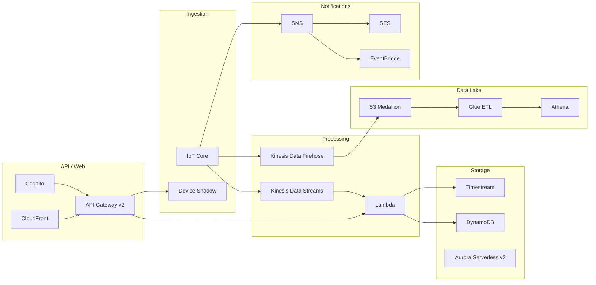

# IoT Cloud Architecture Design (AWS)

Comprehensive cloud architecture design for an IoT device monitoring platform on AWS. This repository contains architecture documentation with Mermaid diagrams, technology comparison tables, and justified design recommendations — demonstrating cloud architecture expertise for a technical assessment.

## Overview

The platform supports **thousands of IoT devices** that connect hourly to push telemetry, configuration, and alarm data (JSON). The architecture is **serverless-first**, **decoupled by design**, and **cost-optimized** for real-world production workloads.

```
Devices ─── IoT Core ─── Kinesis ─── Lambda ─── Timestream / DynamoDB
                │                                        │
          Rules Engine                              API Gateway
                │                                        │
         Device Shadow                    Cognito ─── Lambda ─── SPA
                │                                        │
          SNS / SES ─── EventBridge              S3 + CloudFront
                                                         │
                                               Glue ETL ─── Athena
```

### Key Numbers

| Metric | Value |
|--------|-------|
| Device scale | 1,000 - 10,000 |
| Estimated monthly cost | $40 - $303 (depending on scale) |
| Architecture documents | 11 |
| Technology comparison tables | 9+ |
| Mermaid diagrams | 15+ (architecture + sequence) |

## Architecture Documents

All documentation is in [`docs/architecture/`](docs/architecture/).

| # | Document | Layer |
|---|----------|-------|
| 01 | [Security Foundation](docs/architecture/01-security-foundation.md) | VPC, IAM, KMS, TLS, WAF |
| 02 | [Device Connectivity & Ingestion](docs/architecture/02-device-connectivity-ingestion.md) | IoT Core, MQTT, Rules Engine |
| 03 | [Device Management](docs/architecture/03-device-management.md) | Device Shadow, Fleet Provisioning |
| 04 | [Data Pipeline Processing](docs/architecture/04-data-pipeline-processing.md) | Kinesis, Lambda batch consumer, DLQ |
| 05 | [Storage Layer](docs/architecture/05-storage-layer.md) | Timestream, DynamoDB, Aurora Serverless v2 |
| 06 | [Alarm Notifications](docs/architecture/06-alarm-notifications.md) | SNS, SES, EventBridge, deduplication |
| 07 | [Data Lake & ETL](docs/architecture/07-data-lake-etl.md) | S3 medallion, Glue ETL, Athena |
| 08 | [API Layer](docs/architecture/08-api-layer.md) | API Gateway HTTP API v2, Cognito JWT |
| 09 | [Web Frontend](docs/architecture/09-web-frontend.md) | S3 + CloudFront OAC, command flow |
| 10 | [Architecture Overview & Sequences](docs/architecture/10-overview-and-sequences.md) | System diagram, 3 sequence diagrams |
| 11 | [Cost Analysis](docs/architecture/11-cost-analysis.md) | Per-service cost, optimization strategies |

### Where to Start

- **Quick overview:** [10 - Architecture Overview](docs/architecture/10-overview-and-sequences.md) — full system diagram and end-to-end flows
- **Deep understanding:** Read docs 01 through 09 in order — each layer builds on the previous
- **Cost assessment:** [11 - Cost Analysis](docs/architecture/11-cost-analysis.md) — per-service pricing and 7 optimization strategies

## Design Principles

- **Serverless-first** — Zero idle cost for compute (Lambda, API Gateway, Athena). Pay only for usage.
- **Decoupled layers** — Each layer communicates via managed AWS services (Kinesis, SNS, S3). No direct coupling.
- **Security by default** — All databases in private VPC subnets. No public endpoints. KMS encryption at rest. TLS 1.2+ in transit.
- **Cost-optimized** — IoT Core Basic Ingest (~50% savings), Graviton2 Lambda (~20%), Parquet partitioning (~80-90% Athena scan reduction).
- **Disconnected-device-ready** — Device Shadow desired/delta pattern queues commands for devices connecting only hourly.

## Key Architectural Decisions

| Decision | Choice | Alternatives Considered |
|----------|--------|------------------------|
| IoT entry point | AWS IoT Core | IoT SiteWise, self-managed EMQX |
| Stream buffer | Kinesis Data Streams | Amazon MSK, Amazon SQS |
| Time-series storage | Amazon Timestream | DynamoDB (time-sorted), InfluxDB |
| Relational storage | Aurora Serverless v2 | RDS Provisioned, DynamoDB |
| ETL trigger | EventBridge Scheduler | S3 event-driven, Glue Workflow |
| Query engine | Amazon Athena | Redshift Spectrum, EMR |
| API front door | API Gateway HTTP API v2 | REST API v1, App Runner |
| Web hosting | S3 + CloudFront | Managed Grafana, Amplify Hosting |
| Authentication | Cognito User Pools | IAM Identity Center, self-managed |

Each decision includes a detailed comparison table with pros, cons, and justification in the corresponding document.

## Technology Stack



## Project Structure

```
docs/
  architecture/
    README.md                          # Document index with reading order
    01-security-foundation.md          # VPC, IAM, KMS, WAF
    02-device-connectivity-ingestion.md
    03-device-management.md
    04-data-pipeline-processing.md
    05-storage-layer.md
    06-alarm-notifications.md
    07-data-lake-etl.md
    08-api-layer.md
    09-web-frontend.md
    10-overview-and-sequences.md       # Start here for the big picture
    11-cost-analysis.md
```

## License

This is a technical assessment deliverable. All rights reserved.
