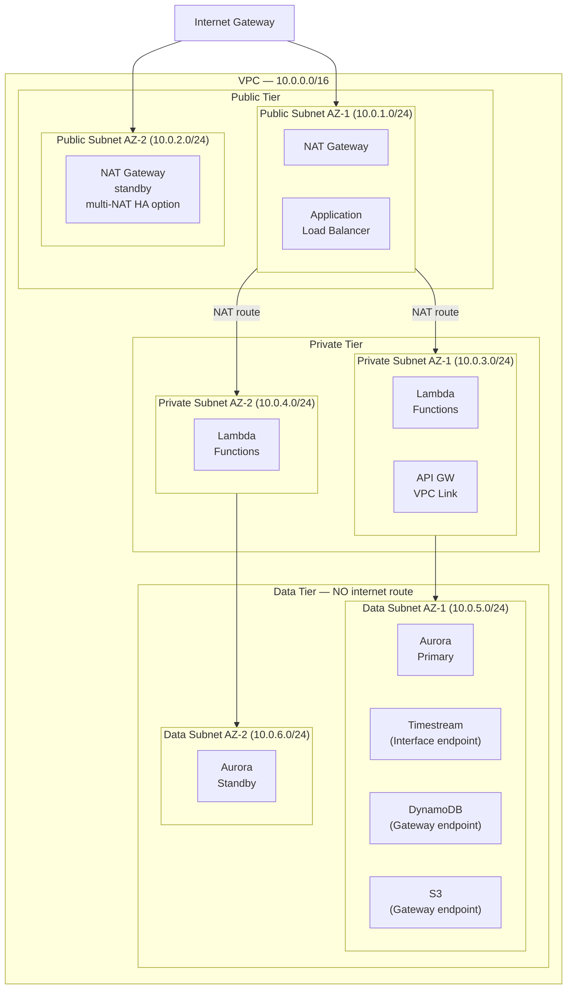

## Security Foundation

This section covers the cross-cutting security concerns that underpin the entire IoT monitoring platform: VPC network isolation, IAM least-privilege roles, encryption at rest (KMS CMKs), encryption in transit (TLS 1.2+), and WAF placement. Every subsequent architecture layer inherits these security controls. Evaluators can use this section to verify that AWS best practices for network isolation, identity management, and encryption are properly applied.

---

### VPC Topology

The platform uses a **3-tier VPC design** (Decision D-01) deployed across **two Availability Zones** (Decision D-02) for resilience. A **single NAT Gateway** in AZ-1 handles outbound internet traffic from the private tier (Decision D-03 — cost-optimized; production HA would deploy one NAT Gateway per AZ).

**CIDR block:** `10.0.0.0/16`

#### Subnet Inventory

| Subnet Name | AZ | CIDR | Tier | Services Hosted |
|---|---|---|---|---|
| Public Subnet AZ-1 | us-east-1a | 10.0.1.0/24 | Public | NAT Gateway, ALB |
| Public Subnet AZ-2 | us-east-1b | 10.0.2.0/24 | Public | (NAT Gateway standby — multi-NAT HA option) |
| Private Subnet AZ-1 | us-east-1a | 10.0.3.0/24 | Private | Lambda Functions, API Gateway VPC Link |
| Private Subnet AZ-2 | us-east-1b | 10.0.4.0/24 | Private | Lambda Functions |
| Data Subnet AZ-1 | us-east-1a | 10.0.5.0/24 | Data | Aurora Primary, Timestream (Interface endpoint), DynamoDB (Gateway endpoint) |
| Data Subnet AZ-2 | us-east-1b | 10.0.6.0/24 | Data | Aurora Standby |

#### VPC Topology Diagram

---

### VPC Endpoints

VPC endpoints allow private subnets to communicate with AWS services without routing traffic through the public internet or a NAT Gateway. There are two types:

- **Gateway endpoints** are free and work via route table entries — no ENI is created. Only available for S3 and DynamoDB.
- **Interface endpoints** create Elastic Network Interfaces (ENIs) in the subnet and cost approximately $7/month per AZ. Required for all other AWS services.

| Service | Endpoint Type | Cost | Justification |
|---|---|---|---|
| Amazon S3 | Gateway | Free | Route-table based; all tiers access S3 for Data Lake and logs |
| Amazon DynamoDB | Gateway | Free | Route-table based; Lambda in private subnet accesses device metadata |
| Amazon Timestream | Interface | ~$7/month per AZ | ENI-based; Lambda queries time-series telemetry from private subnet |
| AWS IoT Core Credential Provider | Interface | ~$7/month per AZ | ENI-based; Lambda invokes IoT Data Plane SDK (UpdateThingShadow) |
| AWS Secrets Manager | Interface | ~$7/month per AZ | ENI-based; Lambda retrieves Aurora credentials at startup |
| Amazon SQS | Interface | ~$7/month per AZ | ENI-based; Lambda sends to DLQ on processing failure |
| Amazon Kinesis | Interface | ~$7/month per AZ | ENI-based; Lambda reads from Kinesis streams in private subnet |

---

### Security Groups

| Security Group | Inbound | Outbound | Attached To |
|---|---|---|---|
| sg-lambda | None (Lambda-initiated only) | TCP 5432 → sg-aurora; HTTPS 443 → VPC endpoints | Lambda functions in private subnet |
| sg-aurora | TCP 5432 from sg-lambda | None required | Aurora cluster (data subnet) |
| sg-alb | TCP 443 from 0.0.0.0/0 (HTTPS) | TCP 443 → sg-lambda (via VPC Link) | Application Load Balancer (public subnet) |
| sg-vpce | TCP 443 from sg-lambda | None required | Interface VPC endpoints (data subnet) |

> **Note:** Gateway endpoints (S3, DynamoDB) do not require security groups — they use route table entries and are controlled via endpoint policies.

---

### Route Tables

| Route Table | Destination | Target | Notes |
|---|---|---|---|
| rt-public | 0.0.0.0/0 | Internet Gateway | Public subnet internet access |
| rt-public | 10.0.0.0/16 | local | VPC-internal traffic |
| rt-private | 0.0.0.0/0 | NAT Gateway | Lambda outbound internet (AWS API calls) |
| rt-private | 10.0.0.0/16 | local | VPC-internal traffic |
| rt-private | pl-xxxxxxx (S3 prefix list) | vpce-s3 | S3 Gateway endpoint route |
| rt-private | pl-xxxxxxx (DynamoDB prefix list) | vpce-dynamodb | DynamoDB Gateway endpoint route |
| rt-data | 10.0.0.0/16 | local | VPC-internal only — NO internet route |
| rt-data | pl-xxxxxxx (S3 prefix list) | vpce-s3 | S3 Gateway endpoint route |
| rt-data | pl-xxxxxxx (DynamoDB prefix list) | vpce-dynamodb | DynamoDB Gateway endpoint route |

> **Important:** The data subnet route table (`rt-data`) has **NO `0.0.0.0/0` entry** — Aurora, Timestream, and DynamoDB cannot reach the internet. All outbound traffic from the data tier is limited to VPC-internal addresses and Gateway endpoint prefix lists.

---

### IAM Least-Privilege Roles

Every AWS service in the architecture assumes a dedicated IAM role scoped to the minimum permissions required (Decision D-13, Requirement SEC-03). No service uses the root account or broad `*` permissions. Each role's trust policy restricts `sts:AssumeRole` to the specific AWS service principal (e.g., `lambda.amazonaws.com`, `iot.amazonaws.com`).

| Role Name | Assumed By | Permissions | Scope |
|---|---|---|---|
| IoTRulesTelemetryRole | IoT Rules Engine | `kinesis:PutRecord` | Specific Kinesis stream ARN |
| IoTRulesAlarmRole | IoT Rules Engine | `lambda:InvokeFunction` | Specific Lambda function ARN |
| IoTRulesConfigRole | IoT Rules Engine | `dynamodb:PutItem` | Specific DynamoDB config table ARN |
| IoTRulesErrorRole | IoT Rules Engine | `sqs:SendMessage` | Specific SQS DLQ ARN |
| LambdaAlarmRole | Lambda (alarm evaluator) | `sns:Publish`, `dynamodb:GetItem`, `dynamodb:PutItem` | Specific SNS topic ARN + DynamoDB table ARNs |
| LambdaAPIRole | Lambda (API handlers) | `dynamodb:GetItem/PutItem/Query`, `timestream:Select` | Specific DynamoDB table + Timestream database ARNs |
| LambdaShadowWriterRole | Lambda (command handler) | `iot:UpdateThingShadow` | `arn:aws:iot:{region}:{account}:thing/*` (thing ARN pattern) |
| GlueETLRole | AWS Glue ETL jobs | `s3:GetObject`, `s3:PutObject`, `glue:GetTable` | Specific S3 bucket + Glue catalog ARNs |
| FirehoseDeliveryRole | Kinesis Firehose | `s3:PutObject`, `s3:PutObjectAcl` | Specific S3 Data Lake bucket ARN |
| CognitoAuthRole | Cognito Identity Pool (authenticated users) | `timestream:Select`, `s3:GetObject` | Scoped Timestream DB + S3 prefix |

Each role's trust policy restricts `sts:AssumeRole` to the specific AWS service principal (e.g., `lambda.amazonaws.com`, `iot.amazonaws.com`).

---

### Encryption at Rest (KMS)

All data stores use AWS KMS customer-managed keys (CMKs) for encryption at rest (Requirement SEC-04). CMKs provide a full audit trail via CloudTrail and support automatic annual key rotation. A CMK can be shared across services via key policy grants, or separate CMKs per service can be used for finer-grained access control. For this architecture, **one CMK per service category** (storage, streaming, audit) is recommended.

| Service | Encryption Type | Key | What It Protects |
|---|---|---|---|
| S3 (Data Lake) | SSE-KMS | Customer-managed CMK | Raw JSON and Parquet objects in bronze/silver/gold zones |
| DynamoDB | Encryption at rest | Customer-managed CMK | Device metadata, command queue, config state |
| Timestream | Storage encryption | Customer-managed CMK (magnetic store) | Time-series telemetry records |
| Aurora PostgreSQL | Storage encryption | Customer-managed CMK | User accounts, roles, alert rule configurations |
| Kinesis Data Streams | Server-side encryption | Customer-managed CMK | In-flight telemetry records in stream shards |
| CloudTrail | SSE-KMS | Customer-managed CMK | API audit logs |

---

### Encryption in Transit (TLS)

All communication uses **TLS 1.2 or higher** (Requirement SEC-05). IoT Core enforces TLS 1.2 minimum at the protocol level — devices connecting via MQTT on **port 8883** perform mutual TLS authentication (mTLS) using X.509 device certificates. HTTPS endpoints (API Gateway, CloudFront) enforce TLS 1.2 via AWS-managed certificate policies.

**TLS enforcement points:**

- **IoT Core MQTT (port 8883):** Mutual TLS — device X.509 certificate + AWS server certificate. TLS 1.2 minimum enforced by IoT Core. No application-level configuration needed.
- **API Gateway HTTPS:** TLS 1.2 enforced by default. ACM-managed certificate attached to custom domain.
- **CloudFront HTTPS:** TLS 1.2 minimum security policy (`TLSv1.2_2021`). ACM certificate in us-east-1.
- **Aurora PostgreSQL:** In-transit encryption via SSL/TLS enforced by `rds.force_ssl=1` parameter.
- **VPC Endpoint traffic:** Interface endpoints use TLS — traffic between Lambda and Timestream/Secrets Manager is encrypted in transit within the AWS backbone.

---

### Web Application Firewall (WAF)

AWS WAF WebACLs are attached to two resources to protect all external-facing entry points (Requirement SEC-06). IoT Core MQTT connections are NOT behind WAF — they are authenticated via X.509 mutual TLS, which provides equivalent protection against unauthorized access.

| WebACL | Attached To | Managed Rule Groups | Custom Rules |
|---|---|---|---|
| waf-cloudfront | CloudFront distribution (SPA) | AWSManagedRulesCommonRuleSet, AWSManagedRulesKnownBadInputsRuleSet | Rate limiting: 1000 requests/5min per IP |
| waf-api | API Gateway HTTP API stage | AWSManagedRulesCommonRuleSet, AWSManagedRulesSQLiRuleSet | Rate limiting: 500 requests/5min per IP; geo-restriction (optional) |

> **Note:** IoT Core MQTT connections are NOT behind WAF — they are authenticated via X.509 mutual TLS, which provides equivalent protection against unauthorized access.
