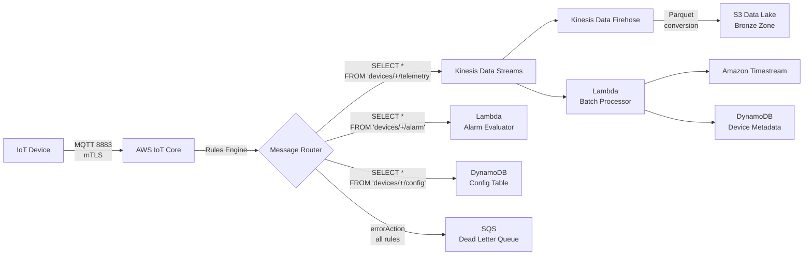

## Device Connectivity and Ingestion Layer

This section documents how IoT devices connect to the cloud platform, the MQTT topic namespace they publish to, how the IoT Rules Engine routes messages by type, and how telemetry flows through Kinesis for cost-optimized batch processing.

---

### AWS IoT Core — Device Entry Point

AWS IoT Core is the managed MQTT broker and HTTPS endpoint for all device communication. Devices publish JSON-formatted telemetry, alarm, and configuration messages over MQTT (port 8883, mutual TLS) or HTTPS (port 443). IoT Core handles TLS termination, certificate-based authentication, topic-level authorization, and message routing via the built-in Rules Engine.

| Protocol | Port | Authentication | Use Case |
|---|---|---|---|
| MQTT | 8883 | X.509 client certificate (mutual TLS) | Primary device communication — persistent connection, bidirectional |
| MQTT over WebSocket | 443 | SigV4 or Cognito token | Browser-based device simulators or dashboards |
| HTTPS | 443 | X.509 or SigV4 | One-shot publish for constrained devices without persistent connections |

> **Basic Ingest (cost optimization):** For high-volume telemetry, devices can publish to reserved topics (`$aws/rules/{ruleName}/devices/{thingName}/telemetry`) to bypass the pub/sub broker and reduce IoT Core messaging costs by approximately 50%. This is recommended when devices send data one-way without needing to receive messages on the same topic.

---

### Topic Namespace

The topic hierarchy follows a `devices/{thingName}/{messageType}` pattern. Each device publishes exclusively to its own namespace, enforced by IoT policies using the `${iot:ThingName}` variable substitution (see [Security — IoT Policy Variables](#iot-policy-variables)).

| Topic Pattern | Message Type | Direction | Payload Example | Consumer |
|---|---|---|---|---|
| `devices/{thingName}/telemetry` | Telemetry | Device → Cloud | `{"temperature": 23.5, "humidity": 67, "ts": 1711500000}` | Rules Engine → Kinesis Data Streams |
| `devices/{thingName}/alarm` | Alarm | Device → Cloud | `{"type": "threshold", "metric": "temperature", "value": 85.2, "ts": 1711500000}` | Rules Engine → Lambda (alarm evaluator) |
| `devices/{thingName}/config` | Config ACK | Device → Cloud | `{"configVersion": 12, "applied": true, "ts": 1711500000}` | Rules Engine → DynamoDB (config table) |
| `$aws/things/{thingName}/shadow/update` | Shadow update | Device → Cloud | `{"state": {"reported": {"sampleRate": 300}}}` | IoT Core Shadow service (managed) |
| `$aws/things/{thingName}/shadow/update/delta` | Shadow delta | Cloud → Device | `{"state": {"sampleRate": 300}, "version": 15}` | Device subscribes on connect |
| `$aws/things/{thingName}/shadow/get` | Shadow get | Device → Cloud | (empty payload) | IoT Core Shadow service (managed) |
| `$aws/things/{thingName}/shadow/get/accepted` | Shadow response | Cloud → Device | Full shadow document | Device receives current state |

> **Note:** Shadow topics (`$aws/...`) are managed by IoT Core and do not require Rules Engine configuration.

---

### Ingestion Data Flow

The diagram below shows the complete message routing from device connection through IoT Core, Rules Engine fan-out to downstream targets, and Kinesis pipeline to storage.

**Flow summary:**
1. Device publishes JSON payload over MQTT (port 8883, mutual TLS) to IoT Core
2. Rules Engine evaluates each incoming message against SQL rules and fans out by message type
3. Telemetry → Kinesis Data Streams (buffered, ordered, replayable)
4. Alarms → Lambda (direct invocation for low-latency notification)
5. Config ACKs → DynamoDB (config state table)
6. All rule failures → SQS DLQ (no silent message loss)
7. Kinesis splits to Firehose (S3 bronze zone) and Lambda batch processor (Timestream + DynamoDB metadata)

---

### IoT Rules Engine — Message Routing

The IoT Rules Engine uses SQL-based rules to inspect each incoming MQTT message and route it to the appropriate downstream AWS service. Each rule targets a specific topic pattern using the `topic(2)` function to extract the `thingName` from the topic hierarchy. Per D-10, every rule includes an `errorAction` that routes failed deliveries to an SQS dead-letter queue (DLQ) to prevent silent message loss.

| Rule Name | SQL Statement | Primary Action | Target | errorAction |
|---|---|---|---|---|
| TelemetryRule | `SELECT *, topic(2) AS thingName FROM 'devices/+/telemetry'` | Kinesis `putRecord` | Kinesis Data Streams (telemetry stream) | SQS DLQ (`iot-rules-dlq`) |
| AlarmRule | `SELECT *, topic(2) AS thingName, timestamp() AS ruleTimestamp FROM 'devices/+/alarm'` | Lambda `invoke` | Lambda function (alarm evaluator) | SQS DLQ (`iot-rules-dlq`) |
| ConfigRule | `SELECT *, topic(2) AS thingName FROM 'devices/+/config'` | DynamoDB `putItem` | DynamoDB table (device-config) | SQS DLQ (`iot-rules-dlq`) |

> **`topic(2)` function:** Extracts the second segment of the topic path (the `thingName`). The `+` wildcard matches any single-level topic segment, so `devices/+/telemetry` matches `devices/sensor-001/telemetry`, `devices/gateway-A/telemetry`, etc.

> **Partition key strategy:** TelemetryRule uses `thingName` as the Kinesis partition key, ensuring all records from the same device land on the same shard for ordered processing.

---

### Kinesis Data Streams — Telemetry Buffer

Kinesis Data Streams serves as the ingestion buffer between IoT Core and downstream processors. This decouples ingestion rate from processing rate, provides 24-hour replay capability, and enables fan-out to multiple consumers (Lambda batch processor and Kinesis Firehose for S3 delivery).

**Why Kinesis over direct Lambda invocation:**

| Approach | Cost at Scale | Replay | Ordering | Backpressure | Recommendation |
|---|---|---|---|---|---|
| IoT Rules → Lambda (direct) | High — one invocation per message | None — lost if Lambda fails | None guaranteed | None — Lambda throttles, messages drop | Not recommended for telemetry |
| IoT Rules → SQS → Lambda | Medium — SQS + Lambda costs | Limited (message retention 4–14 days) | FIFO available but expensive | SQS manages — Lambda polls | Acceptable for command queues |
| IoT Rules → Kinesis → Lambda | Low — batch processing amortizes cost | Yes — 24h–7d retention, replay from any position | Per-shard ordering by partition key | Kinesis buffers — Lambda reads at its own pace | **Recommended for telemetry hot path** |

**Kinesis configuration:**

| Parameter | Value | Rationale |
|---|---|---|
| Mode | On-Demand | Auto-scales shards; no capacity planning required |
| Retention | 24 hours (default) | Extend to 7 days if replay is needed for debugging |
| Partition key | `thingName` | Ensures per-device message ordering within a shard |
| Consumer 1 | Lambda batch processor | Batch size 100–500 records; writes to Timestream and DynamoDB metadata |
| Consumer 2 | Kinesis Data Firehose | Buffers and delivers raw JSON to S3 bronze zone with optional Parquet conversion |

---

### Kinesis Data Firehose — S3 Delivery

Kinesis Data Firehose provides managed delivery of raw telemetry to the S3 Data Lake bronze zone. Firehose handles batching, compression, and optional format conversion (JSON → Parquet) without custom code.

| Parameter | Value |
|---|---|
| Source | Kinesis Data Streams (telemetry stream) |
| Destination | S3 bucket — `s3://iot-datalake-{account}/bronze/telemetry/` |
| Buffer | 60 seconds **or** 1 MB (whichever comes first) |
| Format | Raw JSON (bronze zone); Parquet conversion available via Glue Data Catalog schema |
| Partitioning | Dynamic partitioning by `year=/month=/day=/` using Firehose JQ expressions on the timestamp field |
| Compression | GZIP for JSON, Snappy for Parquet |
| Error handling | Failed records → S3 error prefix: `s3://iot-datalake-{account}/errors/firehose/` |

> **Dynamic partitioning** splits incoming data into time-based S3 prefixes (e.g., `bronze/telemetry/year=2026/month=03/day=27/`) enabling efficient partition pruning when querying with Amazon Athena. Firehose evaluates the `ts` field from each JSON record using a JQ expression: `.ts | strftime("%Y/%m/%d")`.
