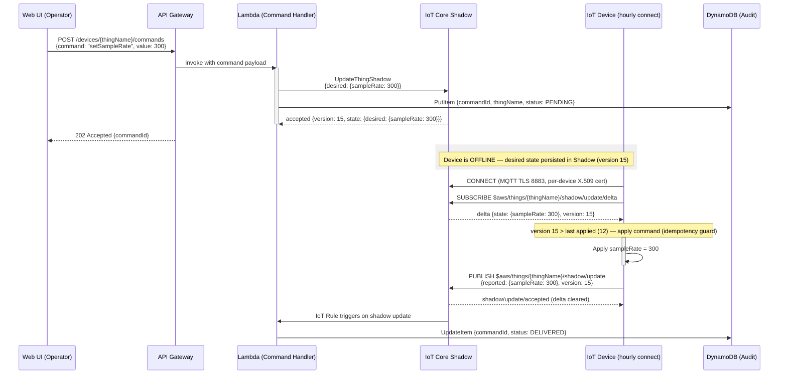

# Device Management

## Device Management

This section documents how the platform manages IoT devices — command delivery via Device Shadow, certificate-based authentication via Fleet Provisioning, per-device authorization via IoT policy variables, and fleet organization via Thing Types and Thing Groups.

---

### Device Shadow — Command Delivery to Disconnected Devices

Devices in this architecture connect hourly for data push, meaning they are offline most of the time. AWS IoT Core Device Shadow provides a persistent cloud-side state document for each device, containing `desired` (what the cloud wants), `reported` (what the device confirmed), and a computed `delta` (the difference). When an operator sends a command, the cloud writes to `desired`; when the device reconnects, it receives the `delta` containing only changed fields, applies them, and updates `reported` to confirm. The shadow reconciles automatically when `desired` equals `reported`.

#### Key Concepts

| Concept | Description |
|---|---|
| `desired` state | Set by cloud (Lambda) — represents the target configuration or command |
| `reported` state | Set by device — represents the actual device configuration after applying commands |
| `delta` state | Computed by IoT Core — contains fields where `desired` differs from `reported` |
| `version` | Monotonically increasing integer — used for optimistic locking and idempotency |
| Named shadow | Each device can have multiple named shadows for different concerns (e.g., `config`, `firmware`) |

#### Command Delivery Sequence Diagram

The following diagram shows the complete lifecycle of a command from operator action to device confirmation. This flow handles the device being offline at the time of command issuance — the shadow persists the desired state until the device reconnects.

#### Version-Based Idempotency

Every shadow update increments the version number, enabling the device to detect and discard duplicate commands:

- Every shadow update increments the `version` counter atomically in IoT Core.
- The device stores the last successfully applied version in local persistent storage.
- When a delta arrives, the device compares the received `version` to its last applied version.
- If received `version` <= last applied, the delta is discarded — this prevents double-execution from retransmissions or MQTT QoS 1 duplicates.
- If the device sends an update with a stale version, IoT Core returns **HTTP 409 Conflict** — the device must fetch the latest shadow and retry.

This mechanism ensures exactly-once execution semantics for commands even when the device receives the same delta multiple times due to network retries.

#### Device Shadow vs Alternatives

| Approach | Offline Support | Complexity | AWS Integration | Recommendation |
|---|---|---|---|---|
| Device Shadow (desired/reported/delta) | Built-in — persists while device is offline | Low — managed by IoT Core | Native — Rules Engine, Lambda triggers | **Recommended** |
| SQS queue per device | Yes — messages retained 14 days | High — custom polling logic, per-device queues | Manual — must poll from device or proxy | Not recommended for this use case |
| DynamoDB polling | Yes — records persist indefinitely | High — custom poll + mark-as-read logic | Manual — device or proxy must query | Not recommended — polling waste |
