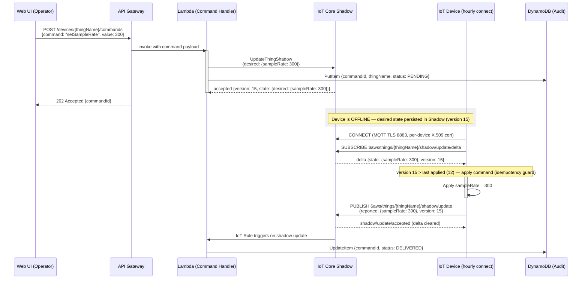

# Device Management

## Device Management

This section documents how the platform manages IoT devices — command delivery via Device Shadow, certificate-based authentication via Fleet Provisioning, per-device authorization via IoT policy variables, and fleet organization via Thing Types and Thing Groups.

---

### Device Shadow — Command Delivery to Disconnected Devices

Devices in this architecture connect hourly for data push, meaning they are offline most of the time. AWS IoT Core Device Shadow provides a persistent cloud-side state document for each device, containing `desired` (what the cloud wants), `reported` (what the device confirmed), and a computed `delta` (the difference). When an operator sends a command, the cloud writes to `desired`; when the device reconnects, it receives the `delta` containing only changed fields, applies them, and updates `reported` to confirm. The shadow reconciles automatically when `desired` equals `reported`.

#### Key Concepts

| Concept | Description |
|---|---|
| `desired` state | Set by cloud (Lambda) — represents the target configuration or command |
| `reported` state | Set by device — represents the actual device configuration after applying commands |
| `delta` state | Computed by IoT Core — contains fields where `desired` differs from `reported` |
| `version` | Monotonically increasing integer — used for optimistic locking and idempotency |
| Named shadow | Each device can have multiple named shadows for different concerns (e.g., `config`, `firmware`) |

#### Command Delivery Sequence Diagram

The following diagram shows the complete lifecycle of a command from operator action to device confirmation. This flow handles the device being offline at the time of command issuance — the shadow persists the desired state until the device reconnects.



#### Version-Based Idempotency

Every shadow update increments the version number, enabling the device to detect and discard duplicate commands:

- Every shadow update increments the `version` counter atomically in IoT Core.
- The device stores the last successfully applied version in local persistent storage.
- When a delta arrives, the device compares the received `version` to its last applied version.
- If received `version` <= last applied, the delta is discarded — this prevents double-execution from retransmissions or MQTT QoS 1 duplicates.
- If the device sends an update with a stale version, IoT Core returns **HTTP 409 Conflict** — the device must fetch the latest shadow and retry.

This mechanism ensures exactly-once execution semantics for commands even when the device receives the same delta multiple times due to network retries.

#### Device Shadow vs Alternatives

| Approach | Offline Support | Complexity | AWS Integration | Recommendation |
|---|---|---|---|---|
| Device Shadow (desired/reported/delta) | Built-in — persists while device is offline | Low — managed by IoT Core | Native — Rules Engine, Lambda triggers | **Recommended** |
| SQS queue per device | Yes — messages retained 14 days | High — custom polling logic, per-device queues | Manual — must poll from device or proxy | Not recommended for this use case |
| DynamoDB polling | Yes — records persist indefinitely | High — custom poll + mark-as-read logic | Manual — device or proxy must query | Not recommended — polling waste |

---

### X.509 Certificate Authentication

Every device authenticates to IoT Core using a unique X.509 certificate. Devices are provisioned at scale using **Fleet Provisioning by Claim** — a factory-embedded shared claim certificate is exchanged for a per-device certificate on first connection. This eliminates the need for manual certificate installation on each device and scales to thousands of devices without operational overhead.

#### Fleet Provisioning Sequence

```mermaid
sequenceDiagram
    participant Factory as Factory / Device
    participant Device as IoT Device
    participant IoTCore as IoT Core
    participant ProvLambda as Provisioning Lambda (pre-hook)
    participant DDB as DynamoDB (allowlist)

    Factory->>Device: Embed claim certificate + restrictive IoT policy<br/>(allows only $aws/certificates/create/+ and $aws/provisioning-templates/+/provision/+)

    Device->>IoTCore: CONNECT (MQTT TLS 1.2, claim certificate)
    Device->>IoTCore: CreateKeysAndCertificate<br/>(or CreateCertificateFromCsr — CSR-based; private key never leaves device)
    IoTCore-->>Device: New certificate + private key + certificateOwnershipToken (1-hour expiry)

    Device->>IoTCore: RegisterThing {certificateOwnershipToken, templateName}
    IoTCore->>ProvLambda: Pre-hook: validate device identity
    ProvLambda->>DDB: GetItem — check device serial in allowlist
    DDB-->>ProvLambda: Item found / not found
    ProvLambda-->>IoTCore: allow / deny

    IoTCore->>IoTCore: Create IoT Thing<br/>Attach per-device certificate<br/>Assign Thing Groups<br/>Set Thing Type
    IoTCore-->>Device: Provisioning complete

    Device->>Device: Save per-device certificate to secure storage
    Device->>IoTCore: DISCONNECT claim cert session
    Device->>IoTCore: RECONNECT with new per-device certificate
```

> **Note:** `CreateCertificateFromCsr` is the more secure option — the private key is generated on the device and never transmitted to AWS. Use `CreateKeysAndCertificate` only when the device lacks a hardware secure element for key generation.

> **Batch isolation:** Claim certificates should be unique per manufacturing batch. If a claim cert is compromised, only that batch needs revocation — all already-provisioned devices are unaffected.

> **Certificate rotation (v2):** Replacing per-device certificates before expiry is a design consideration for a v2 implementation. The initial architecture documents this as a future enhancement (D-07) — not part of the initial deployment.

#### Provisioning Method Comparison

| Method | Scale | Automation | Security | Recommendation |
|---|---|---|---|---|
| Fleet Provisioning by Claim | High — thousands of devices | Full — zero-touch after factory | Claim cert per batch; per-device cert issued automatically | **Recommended** |
| Just-in-Time Registration (JITR) | Medium | Semi — requires custom CA + Lambda | Custom CA required; more control but more complexity | Alternative for custom CA scenarios |
| Manual provisioning (console/CLI) | Low — tens of devices | None — per-device manual steps | Direct cert issuance — simple but unscalable | Dev/test only |

---

### IoT Policy — Per-Device Authorization

Each device's X.509 certificate has an attached IoT policy that uses `${iot:ThingName}` policy variables to restrict the device to its own topic namespace. A single policy template is reused across all devices — the variable substitution happens at runtime when the device connects.

#### IoT Policy Template (Per-Device Scoping)

```json
{
  "Version": "2012-10-17",
  "Statement": [
    {
      "Effect": "Allow",
      "Action": "iot:Connect",
      "Resource": "arn:aws:iot:{region}:{accountId}:client/${iot:ClientId}"
    },
    {
      "Effect": "Allow",
      "Action": "iot:Publish",
      "Resource": [
        "arn:aws:iot:{region}:{accountId}:topic/devices/${iot:ThingName}/telemetry",
        "arn:aws:iot:{region}:{accountId}:topic/devices/${iot:ThingName}/alarm",
        "arn:aws:iot:{region}:{accountId}:topic/devices/${iot:ThingName}/config"
      ]
    },
    {
      "Effect": "Allow",
      "Action": ["iot:Subscribe", "iot:Receive"],
      "Resource": [
        "arn:aws:iot:{region}:{accountId}:topicfilter/$aws/things/${iot:ThingName}/shadow/update/delta",
        "arn:aws:iot:{region}:{accountId}:topicfilter/$aws/things/${iot:ThingName}/shadow/get/accepted"
      ]
    }
  ]
}
```

This policy ensures that device `sensor-001` can only publish to `devices/sensor-001/telemetry`, `devices/sensor-001/alarm`, and `devices/sensor-001/config`. It cannot publish to any other device's topics. The `iot:Subscribe` and `iot:Receive` actions are restricted to the device's own shadow delta and get/accepted topics.

> **Security Anti-Pattern:** A policy with `iot:*` on `arn:aws:iot:*:*:*` means any compromised device certificate can publish to any other device's topic, read other devices' shadow state, and potentially issue commands. Always use `${iot:ThingName}` scoping.

---

### Device Fleet Organization — Thing Types and Thing Groups

The IoT device registry organizes devices using **Thing Types** (shared attribute schemas) and **Thing Groups** (hierarchical grouping for policy and management). Together they enable fleet-wide operations — firmware updates, policy changes, monitoring — without per-device configuration.

#### Thing Types

| Thing Type | Attributes | Use Case |
|---|---|---|
| `SensorDevice` | `firmwareVersion`, `hardwareRevision`, `manufacturer`, `model` | Standard sensor devices (temperature, humidity, pressure) |
| `GatewayDevice` | `firmwareVersion`, `hardwareRevision`, `manufacturer`, `connectedSensorCount` | Gateway devices aggregating multiple sensors |

#### Thing Groups Hierarchy

```
Root
└── AllDevices (group)
    ├── TemperatureSensors (group) — Thing Type: SensorDevice
    │   ├── Factory-A-TempSensors (subgroup)
    │   └── Factory-B-TempSensors (subgroup)
    ├── PressureSensors (group) — Thing Type: SensorDevice
    └── Gateways (group) — Thing Type: GatewayDevice
```

Policies attached to a Thing Group apply to all member devices. This enables fleet-wide configuration updates — update the group policy rather than modifying each device individually. A device can belong to multiple groups. Child groups inherit parent group policies.

#### Dynamic Thing Groups

Dynamic Thing Groups use fleet indexing queries to automatically include devices matching criteria. For example:

```
attributes.firmwareVersion < '2.0'
```

This query automatically includes all devices with firmware older than version 2.0, enabling targeted firmware update campaigns or monitoring of devices with specific attribute values — without manually maintaining group membership.
