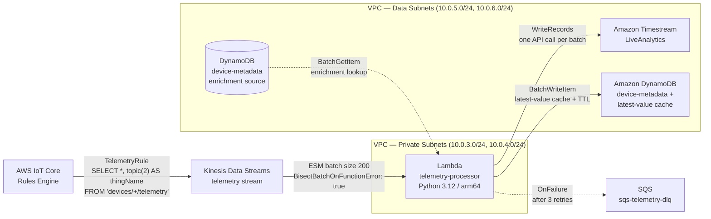

## Data Pipeline — Telemetry Hot-Path Processing

This section documents how telemetry flows from Kinesis Data Streams (configured in the Device Connectivity layer) through Lambda batch processing into Timestream and DynamoDB. The processing pipeline uses Kinesis Event Source Mapping (ESM) to deliver records in batches, amortizing Lambda cold starts and enabling 24-hour replay capability. Two Lambda consumers are involved: the `telemetry-processor` (Kinesis batch consumer) and the `alarm-evaluator` (asynchronous invocation from IoT Rules Engine) — both are covered in this section.

---

### Lambda Batch Consumer Configuration

The `telemetry-processor` Lambda is connected to Kinesis Data Streams via an Event Source Mapping (ESM). The ESM handles batching, retry logic, and failure routing without custom polling code. All ESM parameters were selected per Decision D-01.

| Parameter | Value | Rationale |
|---|---|---|
| BatchSize | 200 | Within the 100–500 optimal range; amortizes cold starts across 200 records per invocation |
| BisectBatchOnFunctionError | `true` | On Lambda failure, Kinesis splits the failed batch and retries each half independently, isolating poison-pill records without discarding the entire batch |
| MaximumRetryAttempts | 3 | After 3 failed attempts on a bisected batch, the record set routes to the SQS DLQ |
| ParallelizationFactor | 1 | One concurrent Lambda invocation per shard; increase to 10 for higher per-shard throughput |
| DestinationConfig.OnFailure | SQS DLQ ARN (`sqs-telemetry-dlq`) | Failed batches after bisect exhaustion route here — no silent data loss |
| Runtime | Python 3.12 / arm64 | Graviton2 (arm64) provides 20% cost reduction at equivalent performance vs x86_64 |

> **Cold start amortization:** At batch size 200, the overhead of one Lambda cold start is spread across 200 records — equivalent to 1/200th of the cost of per-message invocation. At 1,000 devices publishing hourly, this translates to ~5 invocations/hour per shard vs 1,000 invocations/hour with direct Lambda.

---

### JSON Transformation Example

The `telemetry-processor` Lambda performs a three-step transformation per record (Decision D-02):

**Step 1 — Raw device payload (from Kinesis record):**

```json
{
  "temperature": 85.2,
  "humidity": 67,
  "ts": 1711500000,
  "thingName": "sensor-001"
}
```

**Step 2 — DynamoDB device-metadata lookup (by `thingName`):**

```json
{
  "thingName": "sensor-001",
  "deviceType": "temperature-sensor",
  "location": "warehouse-A",
  "firmwareVersion": "2.3.1"
}
```

The Lambda performs a `BatchGetItem` call to the DynamoDB `device-metadata` table once per batch (not per record) — keyed by unique `thingName` values in the batch — to minimize read unit consumption.

**Step 3a — Normalized Timestream `WriteRecords` format:**

```json
{
  "Dimensions": [
    {"Name": "thingName",   "Value": "sensor-001"},
    {"Name": "deviceType",  "Value": "temperature-sensor"},
    {"Name": "location",    "Value": "warehouse-A"}
  ],
  "MeasureName": "temperature",
  "MeasureValue": "85.2",
  "MeasureValueType": "DOUBLE",
  "Time": "1711500000000"
}
```

**Step 3b — DynamoDB latest-value cache write (same Lambda invocation):**

```json
{
  "PK": "DEVICE#sensor-001",
  "SK": "LATEST",
  "temperature": 85.2,
  "humidity": 67,
  "ts": 1711500000,
  "ttl": 1711503600
}
```

The `ttl` field (unix timestamp + 3600 seconds) tells DynamoDB to auto-delete this item after 1 hour. The dashboard reads from this cache for instant current-value lookups without querying Timestream.

---

### Hot-Path Data Flow Diagram



**Access path:** Lambda functions run in private subnets and reach Timestream via Interface VPC endpoint and DynamoDB via Gateway VPC endpoint — no traffic traverses the public internet. Both endpoint types are provisioned in the data subnet route tables per the Phase 1 VPC topology.

---

### Processing Approach Comparison

Three architectural approaches were evaluated for routing Kinesis records to storage (Decision D-03). The comparison uses concrete metrics at 1,000 devices publishing one message per hour.

| Approach | Throughput | Cost at 1K devices/hourly | Replay | Ordering | Operational Complexity |
|---|---|---|---|---|---|
| IoT Rules → Lambda (per-message) | 1 invocation/message; throttles at concurrency limit | High — 1,000 invocations/hour minimum; cold starts on each spike | None — lost if Lambda fails | None | Low setup, high cost at scale |
| IoT Rules → SQS → Lambda | 1 invocation per SQS batch (up to 10 messages) | Medium — SQS + Lambda; FIFO adds cost | 4–14 days message retention; no stream replay | FIFO optional (costly) | Medium — SQS queue management |
| IoT Rules → Kinesis → Lambda (batch) **[Recommended]** | 1 invocation per 100–500 records; linear scaling | **Low** — 10–20x fewer invocations; Graviton2 reduces compute cost | **Yes** — 24h–7d stream replay from any position | Per-shard, by partition key | Medium — ESM config, shard management |

**Recommendation:** Kinesis batch processing is the recommended approach for the telemetry hot path. At 1,000 devices publishing hourly, per-message Lambda invocation costs 10–20x more than batch processing. Kinesis also provides 24-hour replay capability — enabling reprocessing of historical data after bug fixes or schema changes — which neither direct Lambda nor SQS offers. The `thingName` partition key guarantees per-device ordering within a shard, enabling correct time-series reconstruction without client-side sorting.

---

### SQS Dead-Letter Queue Configuration

All Lambda consumers in the processing pipeline have SQS dead-letter queues configured (Decision D-04, PROC-02). No Lambda consumer is permitted to fail silently.

| Consumer Lambda | DLQ Name | maxReceiveCount | Retention | CloudWatch Alarm |
|---|---|---|---|---|
| `telemetry-processor` | `sqs-telemetry-dlq` | 3 | 14 days | `ApproximateNumberOfMessagesVisible > 0` triggers SNS alert to ops |
| `alarm-evaluator` | `sqs-alarm-dlq` | 3 | 14 days | `ApproximateNumberOfMessagesVisible > 0` triggers SNS alert to ops |

> **Critical distinction — ESM DLQ vs function-level DLQ:**
>
> For Kinesis ESM consumers (`telemetry-processor`), the DLQ is configured via `DestinationConfig.OnFailure` on the **Event Source Mapping resource**, NOT on the Lambda function configuration. Lambda function-level `DeadLetterConfig` applies only to **asynchronous invocations**.
>
> For the `alarm-evaluator` (invoked asynchronously by the IoT Rules Engine), `DeadLetterConfig` IS configured on the Lambda function itself.
>
> Both DLQ types must be present — this distinction is critical. A `DeadLetterConfig` on the `telemetry-processor` Lambda function will NOT catch Kinesis batch failures; only `DestinationConfig.OnFailure` on the ESM does.

---

### Avoid — Anti-Patterns

> **Do NOT configure DLQ on Lambda function for Kinesis consumers.** Use `DestinationConfig.OnFailure` on the ESM resource instead. Lambda function-level `DeadLetterConfig` does not apply to synchronous (stream) invocations from Kinesis.

> **Do NOT send one Timestream `WriteRecords` call per record.** Batch all records from the Kinesis batch into a single `WriteRecords` API call. Timestream charges per write request — one call per record multiplies cost by the batch size.

> **Do NOT use Kinesis Data Analytics (legacy SQL).** This service is deprecated in favor of Managed Service for Apache Flink and no longer accepts new customers. Use Lambda for stateless record-by-record transformations.

---

### Design Notes

- **Two invocation paths:** Lambda processes telemetry via Kinesis ESM (synchronous stream consumer) and alarm events via IoT Rules Engine (asynchronous invocation) using two separate Lambda functions with distinct IAM roles and DLQ configurations.
- **Timestream write batching:** The `telemetry-processor` collects all Timestream records from the entire Kinesis batch and calls `WriteRecords` once per batch — not once per record. This is the primary cost control for Timestream.
- **DynamoDB latest-value cache:** The `DEVICE#{thingName}#LATEST` item enables instant dashboard lookups for current device state without time-range queries against Timestream. A 1-hour TTL keeps the cache fresh without manual cleanup.
- **arm64 (Graviton2) runtime:** Selected for the `telemetry-processor` for 20% cost reduction at equivalent performance. This is the primary Lambda cost optimization lever alongside batch size tuning.
- **DynamoDB metadata enrichment:** The Lambda performs one `BatchGetItem` call per Kinesis batch (not per record) by collecting unique `thingName` values from all records first, then enriching all records from the single response. This keeps DynamoDB read unit consumption proportional to unique devices in the batch, not batch size.
