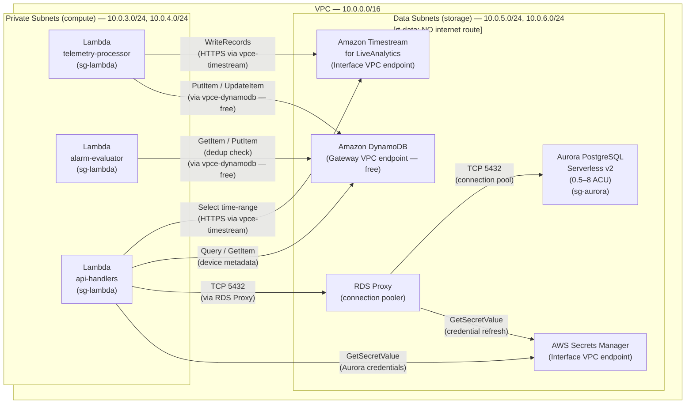

## Storage Layer

This section documents the three-tier storage architecture that serves the IoT platform's hot-path data needs. Each tier is purpose-built for its access pattern: Timestream for time-series telemetry queries, DynamoDB for low-latency key-value lookups, and Aurora Serverless v2 for relational data. All storage services are deployed in VPC private data subnets with no public endpoints — access is restricted to Lambda functions and internal services running within the VPC.

---

### Storage Tier Overview

| Tier | Service | Data Stored | Access Pattern | VPC Access |
|------|---------|-------------|----------------|------------|
| Hot Time-Series | Amazon Timestream for LiveAnalytics | Device telemetry (temperature, humidity, pressure, etc.) | Time-range queries, aggregations, dashboard panels | Interface VPC endpoint (~$7/month per AZ) |
| Operational State | Amazon DynamoDB (On-Demand) | Device metadata, latest-value cache, command queue, alarm dedup records, config state | Single-digit ms key-value lookups, conditional writes | Gateway VPC endpoint (free) |
| Relational | Amazon Aurora PostgreSQL Serverless v2 | Users, roles, alert rule configurations, device groups | SQL queries with joins, complex conditions | Private data subnet, no public endpoint |

---

### Amazon Timestream for LiveAnalytics

**Requirement: STOR-01 | Decision: D-05**

Amazon Timestream for LiveAnalytics is the hot time-series storage tier for all device telemetry ingested through the processing pipeline. It is a purpose-built, serverless time-series database optimized for the exact access patterns of IoT monitoring: ingest millions of data points, then query by time range, device, and metric with aggregation functions.

#### Memory and Magnetic Store Retention

Timestream automatically manages a two-tier storage model:

| Tier | Retention | Query Cost | Use Case |
|------|-----------|-----------|----------|
| Memory Store | 24 hours (configurable) | No per-query cost | Operational dashboards, near-real-time panels, live monitoring |
| Magnetic Store | 365 days (configurable) | $0.01/GB scanned | Historical trend analysis, anomaly detection, compliance reporting |

**Critical note:** Data is tiered from memory to magnetic automatically — it is not deleted. Memory tier queries have no per-query cost; magnetic tier queries cost $0.01/GB scanned. Parquet-based compression in the magnetic store significantly reduces scan costs for time-windowed queries.

#### Pricing and Write Optimization

- **Write pricing:** $0.50 per million records written.
- **Optimization:** Batch all records from a single Lambda invocation into one `WriteRecords` API call. A batch of 100 sensor readings costs the same per-record as 100 individual writes, but reduces Lambda-to-Timestream API call overhead by 100×.

#### Database and Table Structure

| Resource | Name | Key Dimensions | Measures |
|----------|------|----------------|---------|
| Database | `iot-telemetry` | — | — |
| Table | `device-metrics` | `thingName`, `deviceType`, `location` | temperature, humidity, pressure, battery_level (extensible) |

Dimensions are indexed for efficient time-range filtering by device or device group. Measures are the actual telemetry values.

#### VPC Access

Timestream requires an **Interface VPC endpoint** — there is no Gateway endpoint option for Timestream. The endpoint creates an Elastic Network Interface (ENI) in the data subnet and costs approximately $7/month per AZ.

- **VPC endpoint:** `com.amazonaws.us-east-1.timestream.ingest-cell1`
- **Security group:** `sg-vpce` — allows TCP 443 from `sg-lambda`
- **Route table:** `rt-data` — traffic stays within the VPC backbone

See `01-security-foundation.md` for the full VPC endpoint inventory.

---

### Amazon DynamoDB

**Requirement: STOR-02 | Decision: D-05**

DynamoDB serves as the operational state store for all device-centric data that requires single-digit millisecond lookups. Unlike Timestream (optimized for time-range scans across many devices), DynamoDB is optimized for point lookups by device identity — "give me everything I know about device X right now."

#### Table Inventory

| Table / Usage | Partition Key | Sort Key | TTL | Purpose |
|---------------|--------------|---------|-----|---------|
| `device-metadata` | `DEVICE#{thingName}` | `META` | No | Device type, location, firmware version, registration date |
| `device-latest` | `DEVICE#{thingName}` | `LATEST` | 1 hour (3600s) | Most recent telemetry values for dashboard instant lookups — avoids Timestream query for "current value" panels |
| `command-queue` | `DEVICE#{thingName}` | `CMD#{timestamp}` | 24 hours (86400s) | Pending commands awaiting device reconnection — complement to Device Shadow for ordered command history |
| `alarm-dedup` | `DEDUP#{thingName}#{alarmType}` | — (PK only) | 15 minutes (900s) | Deduplication window for alarm notifications — prevents alarm storms during sustained threshold breaches |
| `config-state` | `DEVICE#{thingName}` | `CONFIG` | No | Last applied configuration version and acknowledgment status |

#### Key Design Decisions

**Composite key prefix pattern (`DEVICE#`, `DEDUP#`):** Prevents hot partitions and allows efficient prefix-based queries when needed. All keys follow the `TYPE#{identifier}` convention.

**`alarm-dedup` table:** The `DEDUP#{thingName}#{alarmType}` composite partition key allows a single `PutItem` with `attribute_not_exists(pk)` condition expression to serve as both the existence check and the dedup record creation. This is an atomic, race-condition-free deduplication mechanism with no Lambda-side locking required.

**TTL for transient data:** DynamoDB TTL deletion is free and eventually consistent (items expire within 48 hours of the TTL epoch, with most expiring within minutes). This provides zero-cost cleanup for three transient table types:
- Dedup records (15 min) — alarm storm window
- Command queue (24h) — command expiration for offline devices
- Latest-value cache (1h) — freshness guarantee for dashboard panels

#### Billing and VPC Access

- **Billing:** On-Demand — no capacity planning, auto-scales with traffic. $1.25/million write request units, $0.25/million read request units.
- **VPC access:** Gateway VPC endpoint (free, no per-hour ENI charge). Controlled via endpoint policy — Lambda in private subnet reaches DynamoDB without NAT Gateway traversal.

---

### Amazon Aurora PostgreSQL Serverless v2

**Requirement: STOR-03 | Decision: D-05**

Aurora Serverless v2 stores all relational data that requires SQL joins, complex filtering, and enforced referential integrity — data that is fundamentally about relationships between entities rather than time-series or key-value lookups.

**Relational data stored:**
- **Users:** Account credentials (hashed), email, status
- **Roles (RBAC):** User-to-role assignments, permission scopes
- **Alert rule configurations:** Per-device or per-device-group threshold definitions, notification preferences (which users receive which alerts), escalation rules
- **Device groups:** Logical groupings of devices for role-based access and bulk configuration

#### Scaling Characteristics

Aurora Serverless v2 scales horizontally in ACU (Aurora Capacity Units) increments:

| Parameter | Value | Notes |
|-----------|-------|-------|
| Minimum ACU | **0.5 ACU** | **Not zero** — Aurora Serverless v2 does NOT scale to zero |
| Maximum ACU | 8 ACU (configurable) | Increase for production load |
| Scale-up latency | < 1 second | Near-instantaneous for bursty API traffic |
| Idle cost | ~$0.06/hour | 0.5 ACU × $0.12/ACU-hour |

**Cost implication:** Aurora Serverless v2 scales to a minimum of **0.5 ACU when idle — not zero**. Monthly minimum cost: ~$0.06/hour × 720 hours = **~$43/month**, even with zero traffic. This is an honest cost characteristic that must be factored into the architecture trade-off decision.

#### RDS Proxy (Required for Lambda)

RDS Proxy is a managed connection pooler that sits between Lambda functions and the Aurora cluster.

**Why it is required — not optional:** Lambda cold starts create new TCP connections to Aurora. Without RDS Proxy, concurrent Lambda invocations can exhaust Aurora's connection limit (~300 for small ACU configurations — 0.5 ACU supports approximately 90 connections). A burst of 100 concurrent Lambda invocations would immediately exhaust the connection pool, causing `too many connections` errors. RDS Proxy is required in production for any Lambda → Aurora integration.

| Component | Configuration |
|-----------|---------------|
| Connection pool | RDS Proxy in data subnet (`sg-aurora` security group) |
| Lambda endpoint | Lambda connects to Proxy endpoint, not Aurora directly |
| Multiplexing | Proxy reuses idle connections — 1000 Lambda invocations may use only 10–20 Aurora connections |
| Credentials | Proxy retrieves Aurora credentials from Secrets Manager (no Lambda-side credential caching needed) |

#### Credential Management

AWS Secrets Manager stores the Aurora master credentials and rotates them automatically on a configurable schedule (default: 30 days). Lambda functions retrieve credentials via SDK at startup — no hardcoded credentials in environment variables or source code.

```
Lambda startup → SecretsManager:GetSecretValue → retrieve credential JSON → connect to RDS Proxy → Aurora
```

#### VPC Access

- **Deployment:** Private data subnets (10.0.5.0/24, 10.0.6.0/24)
- **Public endpoint:** Disabled — `PubliclyAccessible: false`
- **Security group:** `sg-aurora` — allows inbound TCP 5432 only from `sg-lambda`
- **Route table:** `rt-data` — no internet route; Aurora cannot be reached from outside the VPC

See `01-security-foundation.md` for the complete security group and route table configuration.

---

### VPC Placement Diagram



> **Reference:** See `01-security-foundation.md` for complete VPC topology, subnet CIDRs, route tables, and security group rules.

---

### Time-Series Storage Comparison

**Decision: D-07 | Requirement: STOR-04**

| Alternative | Pros | Cons | Cost Profile | Recommendation |
|-------------|------|------|-------------|----------------|
| **Amazon Timestream for LiveAnalytics** | Purpose-built for IoT time-series; 1,000× faster time-range queries than relational DBs; automatic memory-to-magnetic tiering (no manual partitioning); serverless with no capacity planning; native integration with Grafana and QuickSight; scales to millions of writes/sec | Vendor lock-in to AWS; limited SQL dialect (subset of ANSI SQL); no ACID transactions; no ad-hoc joins with other services | Writes: $0.50/million records; Memory queries: free (no per-query cost); Magnetic queries: $0.01/GB scanned; Magnetic storage: $0.03/GB-month | **Recommended** — best fit for IoT telemetry range queries and aggregations at scale. Time range queries, multi-device aggregations, and memory-tier caching for dashboards are native capabilities, not workarounds. |
| DynamoDB (time-sorted sort key) | Sub-millisecond point lookups for individual readings; flexible schema; Gateway endpoint (free); can serve both metadata and time-series from a single service | Range queries require careful schema design (PK=deviceId, SK=ISO8601 timestamp); no native aggregation functions (COUNT, AVG require application code); GSI cost for cross-device queries; more expensive for large time-window scans | On-Demand: $1.25/million write RCU, $0.25/million read RCU; no base cost | Use if already heavily invested in DynamoDB and queries are predominantly single-device point lookups (e.g., "last reading for device X") rather than aggregations |
| InfluxDB on EC2 | Rich Flux query language purpose-built for time-series; large open-source community; advanced features (continuous queries, Kapacitor alerting, data downsampling) | Requires EC2 instance management (patching, backups, HA); not serverless; loses native AWS integration (no Firehose delivery, no IAM auth, no CloudWatch metrics); operational overhead is significant | EC2 instance cost: $50–$200/month depending on instance type + EBS storage + manual backup | Avoid for AWS-first design — adds operational overhead without native AWS integration. Only consider if specific Flux query features are a hard requirement. |
| Amazon RDS PostgreSQL (with TimescaleDB or partitioning) | Standard SQL (familiar to all developers); pg_timescaledb extension adds time-series hypertables; works with existing PostgreSQL tooling and ORMs | Not purpose-built for time-series; slower time-range queries at scale without careful manual partitioning; Lambda → RDS connection exhaustion issue (same RDS Proxy solution applies); single-instance throughput limits | RDS instance: $30–$200/month (varies by instance) or Aurora ACU pricing (~$43/month minimum at 0.5 ACU) | Use only if PostgreSQL is a hard organizational requirement and time-series query volume is moderate. TimescaleDB extension helps but does not match Timestream for IoT-scale ingestion. |

---

### Relational Storage Comparison

**Decision: D-07 | Requirement: STOR-04**

| Alternative | Pros | Cons | Cost Profile | Recommendation |
|-------------|------|------|-------------|----------------|
| **Aurora PostgreSQL Serverless v2** | Scales with demand (0.5–8 ACU); PostgreSQL standard SQL (fully compatible with ORMs and tools); Aurora storage engine (faster than community PostgreSQL on writes); managed HA (6-way replication across 3 AZs built into Aurora storage layer); compatible with RDS Proxy for Lambda connection pooling | Minimum 0.5 ACU at idle (not zero — ~$43/month minimum); Serverless v2 is relatively newer (fewer third-party tutorials vs provisioned); scaling to zero requires fully pausing the cluster (Serverless v1 behavior, not available in v2) | $0.12/ACU-hour; ~$43/month minimum at idle (0.5 ACU × 720h); storage: $0.10/GB-month | **Recommended** — best balance of cost, scalability, and standard SQL for relational IoT platform data. PostgreSQL compatibility ensures no vendor lock-in for application code. |
| RDS PostgreSQL Provisioned | Lower per-hour cost at sustained steady load; well-documented with extensive community resources; Reserved Instances available for 1–3 year terms (up to 60% discount); db.t3.micro is inexpensive for dev/test | Cannot scale down at idle — instance runs 24/7 regardless of traffic; manual vertical scaling requires brief downtime; db.t3.micro has limited performance (2 vCPU, 1GB RAM) | db.t3.micro: ~$13/month; db.t3.small: ~$26/month; Reserved 1yr: up to 40% discount | Use for production workloads with predictable 24/7 load where Reserved Instances make economic sense. Not suitable for bursty IoT API patterns where Serverless v2 auto-scales more efficiently. |
| DynamoDB (fully NoSQL architecture) | True zero-cost at zero traffic (On-Demand billing only when accessed); sub-millisecond lookups; infinite horizontal scaling; no connection limit issues with Lambda; single-table design can co-locate relational data | No native SQL joins — relational queries (user + role + alert rule) become application-layer join logic; aggressive denormalization required; complex queries become multi-GetItem round trips; schema evolution is harder without SQL migrations | On-Demand: $1.25/million write RCU, $0.25/million read RCU; no base cost | Use only if fully NoSQL architecture is a hard requirement and all data access patterns can be defined upfront and denormalized accordingly. Not recommended for user/role/alert-rule data with join-heavy access patterns. |
| Aurora PostgreSQL Provisioned | Highest performance (Aurora storage engine with full provisioned IOPS); Multi-AZ HA with automatic failover; Reader replicas for read scaling; proven at very high throughput | Cannot scale to near-zero — provisioned instances run continuously; minimum ~$60/month for db.r5.large (Aurora requires r-series for production); over-provisioned for a thousands-of-devices design exercise | $0.10–$0.32/ACU-hour equivalent depending on instance; ~$60–$300/month | Use for high-throughput production workloads with predictable capacity needs (100K+ concurrent users, millions of transactions/hour). Overkill for the thousands-of-devices monitoring use case at current scale. |

---

### Design Notes

- **Three-tier separation** ensures each storage service handles its optimal access pattern — no single-service compromise forces Timestream to do key-value lookups or DynamoDB to do time-range aggregations.
- **DynamoDB TTL** provides free, zero-code cleanup of transient data (dedup records, command queue entries, latest-value cache). No scheduled jobs or Lambda-based cleanup functions are needed.
- **RDS Proxy is not optional** for Lambda → Aurora integration. Connection exhaustion is the most common production issue with this pattern and is entirely preventable with RDS Proxy in front of Aurora.
- **Aurora Serverless v2 minimum cost (~$43/month)** must be acknowledged honestly in cost planning. For a design exercise with minimal traffic, this is acceptable. For a cost-critical production deployment at low scale, DynamoDB (fully NoSQL) or RDS PostgreSQL Provisioned with Reserved Instances may be evaluated.
- **All VPC endpoints** are documented in `01-security-foundation.md` — this section references that placement without duplicating the subnet CIDR and route table details.
- **Timestream memory store retention** (24 hours in this design) should be tuned based on dashboard query patterns. If dashboards routinely query the last 7 days at memory-tier cost, increase memory retention to 7 days — the trade-off is higher memory store pricing ($0.036/GB-hour) vs magnetic store query costs ($0.01/GB scanned).
- **Secrets Manager** for Aurora credentials ensures no hardcoded credentials anywhere in Lambda code, environment variables, or configuration files. Automatic rotation (every 30 days) is enabled at the Secrets Manager level — no application code changes required.
