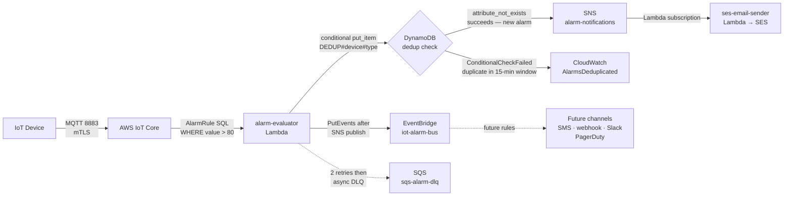

## Alarm Detection and Notification Pipeline

This section documents how alarm events are detected, deduplicated, and delivered to notification channels. The alarm pipeline begins with IoT Rules Engine threshold evaluation, flows through a Lambda alarm evaluator that prevents notification storms via DynamoDB-based deduplication, fans out through SNS to SES for email delivery, and publishes to EventBridge for future channel extensibility.

---

### Alarm Pipeline Component Inventory

| Component | Service | Responsibility | Invocation |
|---|---|---|---|
| Threshold Pre-Filter | IoT Rules Engine (AlarmRule) | Coarse threshold filter via SQL WHERE clause — reduces Lambda invocations by filtering non-alarm messages | IoT Core message matching `devices/+/alarm` |
| Alarm Evaluator | AWS Lambda (Python 3.12, arm64) | Per-device threshold check against Aurora alert rules, deduplication via DynamoDB conditional write, SNS publish, EventBridge event | Async invocation from IoT Rules Engine |
| Dedup Table | Amazon DynamoDB | Stores recent alarm records with TTL for deduplication window | Conditional `put_item` from alarm evaluator Lambda |
| Notification Hub | Amazon SNS (Standard topic: `alarm-notifications`) | Fans out alarm events to all subscribed notification channels | Published by alarm evaluator after dedup check passes |
| Email Delivery | Lambda (`ses-email-sender`) → Amazon SES | Renders HTML alarm email template and sends via SES `SendTemplatedEmail` | SNS subscription on `alarm-notifications` topic |
| Extensibility Bus | Amazon EventBridge (custom bus: `iot-alarm-bus`) | Future notification channels (SMS, webhook, Slack, PagerDuty) via rules | `PutEvents` from alarm evaluator Lambda after SNS publish |
| Dead-Letter Queue | Amazon SQS (`sqs-alarm-dlq`) | Captures failed alarm evaluator invocations for retry and debugging | Lambda `DeadLetterConfig` (async invocation pattern) |

---

### IoT Rules Engine Threshold Detection

Per D-08, the IoT Rules Engine serves as the first line of alarm detection. The AlarmRule — already established in [Device Connectivity and Ingestion](02-device-connectivity-ingestion.md) — routes alarm-type messages from the `devices/+/alarm` topic directly to the alarm evaluator Lambda.

**AlarmRule SQL:**

```sql
SELECT *, topic(2) AS thingName, timestamp() AS ruleTimestamp
FROM 'devices/+/alarm'
WHERE value > 80
```

The `WHERE value > 80` clause acts as a coarse pre-filter. The literal threshold (80) catches obvious breaches before Lambda invocation. The Lambda evaluator then applies per-device thresholds fetched from Aurora `alert_rules` configurations — enabling different thresholds per device type or location without modifying the Rules Engine SQL.

> **Anti-pattern — missing WHERE clause:** Without the `WHERE` clause, every message published to `devices/+/alarm` triggers the Lambda evaluator — including status updates, test messages, and low-value readings. At 1,000 devices sending one message per hour each, this means 1,000 unnecessary Lambda invocations per hour, costing approximately 15× more in Lambda compute than a properly filtered rule. The coarse SQL filter is not optional at IoT scale.

---

### Lambda Alarm Evaluator Flow

Per D-09, the alarm evaluator Lambda applies per-device threshold validation and deduplication before triggering any notification. The evaluator is invoked asynchronously by the IoT Rules Engine (not via Kinesis ESM), which means its DLQ is configured on the Lambda function's `DeadLetterConfig`, not on an Event Source Mapping.

**8-step evaluation flow:**

1. Receive alarm event from IoT Rules Engine (async invocation) — payload contains `thingName`, `ruleTimestamp`, `value`, and raw message fields
2. Extract `thingName` and `alarmType` from the event payload (e.g., `"type": "temperature_high"`)
3. (Optional) Look up per-device threshold from Aurora `alert_rules` table via RDS Proxy — bypassed if device uses the global default threshold
4. If the device-specific value does not exceed the per-device threshold, discard the event (log at DEBUG level and return 200)
5. Attempt DynamoDB conditional write: `put_item` with `ConditionExpression = "attribute_not_exists(PK)"` on composite key `DEDUP#{thingName}#{alarmType}`, with `TTL = current_time + 900` (15-minute dedup window)
6. If the conditional write succeeds (first alarm in window): publish to SNS `alarm-notifications` topic AND call EventBridge `PutEvents` on `iot-alarm-bus`
7. If the conditional write fails (`ConditionalCheckFailedException` — duplicate within 15-minute window): skip SNS and EventBridge publish, increment CloudWatch metric `AlarmsDeduplicated`
8. On any unhandled error: Lambda async retry (2 built-in retries), then routes failed invocation to SQS `sqs-alarm-dlq`

---

### Deduplication Strategy — DynamoDB Conditional Write

Per D-09 and ALRM-04, the dedup table uses a composite primary key of `DEDUP#{thingName}#{alarmType}` with a 15-minute TTL. The `attribute_not_exists(PK)` condition ensures atomic check-and-write — there is no race condition between checking for existence and writing.

**DynamoDB dedup table schema:**

```
PK:           DEDUP#{thingName}#{alarmType}     (e.g., DEDUP#sensor-001#temperature_high)
TTL:          unix_timestamp + 900              (auto-deleted after 15 minutes by DynamoDB TTL)
firstAlarmTs: unix_timestamp                   (timestamp of the first alarm in the window)
alarmValue:   85.2                             (sensor reading that triggered the alarm)
```

**Deduplication pseudo-code:**

```python
import time, json, boto3
from botocore.exceptions import ClientError

table = boto3.resource("dynamodb").Table(DEDUP_TABLE_NAME)
sns = boto3.client("sns")
cloudwatch = boto3.client("cloudwatch")

try:
    table.put_item(
        Item={
            "PK": f"DEDUP#{thing_name}#{alarm_type}",
            "TTL": int(time.time()) + 900,  # 15 minutes
            "firstAlarmTs": event_ts,
            "alarmValue": value
        },
        ConditionExpression="attribute_not_exists(PK)"
    )
    # Condition succeeded -> first alarm in window -> publish to SNS
    sns.publish(TopicArn=ALARM_TOPIC_ARN, Message=json.dumps(alarm_payload))

except ClientError as e:
    if e.response["Error"]["Code"] == "ConditionalCheckFailedException":
        # Duplicate alarm within 15-minute window -> suppress
        cloudwatch.put_metric_data(
            Namespace="IoT/Alarms",
            MetricData=[{"MetricName": "AlarmsDeduplicated", "Value": 1, "Unit": "Count"}]
        )
    else:
        raise  # Re-raise unexpected errors -> Lambda retry -> DLQ
```

**Why DynamoDB TTL for cleanup:** DynamoDB TTL deletes expired dedup items at no charge (deletions do not consume write capacity). This eliminates the need for a scheduled cleanup Lambda or cron job. TTL deletions occur within 48 hours of expiry — acceptable for a 15-minute dedup window.

---

### SNS Fan-Out and SES Email Delivery

Per D-10 and ALRM-02, the alarm evaluator publishes to an SNS Standard topic (`alarm-notifications`) after the dedup check passes. SNS decouples the alarm evaluator from delivery mechanics — adding a new notification channel requires only a new SNS subscription or EventBridge rule, with no changes to the alarm evaluator code.

**SNS topic configuration:**

| Parameter | Value | Notes |
|---|---|---|
| Topic type | Standard | FIFO not required — alarm notifications are idempotent (dedup is upstream) |
| Topic name | `alarm-notifications` | Regional scope; single topic for all alarm types |
| Pricing | $0.50/million publishes | Low cost at IoT scale |

**Current subscription — SES email delivery:**

| Step | Component | Detail |
|---|---|---|
| 1 | SNS → Lambda (`ses-email-sender`) | Lambda subscribed to `alarm-notifications` topic |
| 2 | Lambda renders template | HTML alarm email using SES template (device name, alarm type, value, timestamp, location) |
| 3 | Lambda → SES `SendTemplatedEmail` | Sends to configured alarm recipients |
| 4 | SES delivery | Bounce and complaint tracking enabled; domain verification required before first send |

**SES configuration details:**

- Pricing: $0.10 per 1,000 emails — negligible at IoT alarm frequency
- HTML email templates stored in SES template registry (reusable, version-controlled)
- Bounce handling: SES complaint/bounce notifications route to a dedicated SNS topic (`ses-notifications`)
- Domain verification: custom domain required; SES sandbox lifted for production sends

**Why SNS over direct Lambda → SES:**

| Approach | Extensibility | Coupling | Channel Addition |
|---|---|---|---|
| Direct Lambda → SES | No fan-out | Alarm evaluator must know all delivery channels | Code change required for each new channel |
| SNS as fan-out hub | Unlimited subscriptions | Alarm evaluator publishes one event; SNS routes | Add SNS subscription — zero code changes |

---

### EventBridge Extensibility Layer

Per D-11 and ALRM-03, the alarm evaluator also calls `eventbridge:PutEvents` on a custom event bus (`iot-alarm-bus`) after the SNS publish. This fires for every alarm that passes deduplication, creating a parallel extensibility path independent of the SNS subscription model.

**EventBridge PutEvents call:**

```python
eventbridge = boto3.client("events")

eventbridge.put_events(
    Entries=[{
        "Source": "iot.alarm-evaluator",
        "DetailType": "AlarmTriggered",
        "Detail": json.dumps({
            "thingName": thing_name,
            "alarmType": alarm_type,
            "value": value,
            "threshold": threshold,
            "ts": event_ts
        }),
        "EventBusName": "iot-alarm-bus"
    }]
)
```

**Custom event bus — `iot-alarm-bus`:**

EventBridge rules on `iot-alarm-bus` match on `"source": "iot.alarm-evaluator"` and `"detail-type": "AlarmTriggered"`. Each rule fans out to a different downstream target — adding a channel means adding a rule and target, not modifying the alarm evaluator.

**Future channel extensibility points (per D-11 — architecture extensibility, not initial implementation):**

| Channel | EventBridge Rule Target | Notes |
|---|---|---|
| SMS on-call alert | EventBridge rule → Lambda → SNS SMS | Lambda formats SMS message, sends via SNS `publish` with phone number |
| Webhook (Slack, Teams) | EventBridge rule → API Destination (HTTPS endpoint) | API Destination handles authentication and retry; no Lambda needed for simple webhooks |
| PagerDuty / OpsGenie | EventBridge rule → API Destination | PagerDuty Events API v2 supports direct HTTP POST from API Destination |
| Future SaaS integrations | EventBridge Pipes → third-party SaaS | EventBridge Pipes adds filtering and enrichment between source and target |

> **Per D-12:** Rate-of-change detection (e.g., temperature rising 5°C/minute) and multi-signal correlation alarms (e.g., temperature + humidity combined threshold) are v2 enhancements. These are achievable via EventBridge pattern matching rules and Managed Apache Flink for stateful stream processing — not included in the initial architecture. The `iot-alarm-bus` is already the correct extensibility hook for these v2 patterns.

---

### Alarm Pipeline Mermaid Diagram



> Solid lines show the primary alarm path. Dashed lines show failure/future-extension paths.

---

### Dead-Letter Queue — Alarm Evaluator

Per D-04 and ALRM-04, the alarm evaluator Lambda has a dedicated SQS dead-letter queue. Because the alarm evaluator is invoked **asynchronously** by the IoT Rules Engine (not via a Kinesis Event Source Mapping), the DLQ is configured on the Lambda **function's** `DeadLetterConfig` — not on an ESM `DestinationConfig`. This is an important distinction from the telemetry processor Lambda.

**DLQ configuration — alarm evaluator:**

| Parameter | Value | Notes |
|---|---|---|
| Lambda invocation type | Async (IoT Rules Engine direct invoke) | Rules Engine invokes Lambda asynchronously — Lambda handles internal retry |
| Lambda built-in retries | 2 | Lambda retries async failures twice before routing to DLQ |
| DLQ name | `sqs-alarm-dlq` | SQS Standard queue (ordering not required for error handling) |
| DLQ configuration | Lambda function `DeadLetterConfig.TargetArn` | Set on the function, not on an ESM |
| Retention | 14 days | Window for debugging failed alarm invocations |
| CloudWatch alarm | `ApproximateNumberOfMessagesVisible > 0` | Triggers ops notification via SNS (separate ops topic) when any alarm fails DLQ |

**Why function-level DLQ (not ESM-level):**

| Consumer | Trigger Type | DLQ Configuration |
|---|---|---|
| `telemetry-processor` Lambda | Kinesis ESM (stream trigger) | ESM `DestinationConfig.OnFailure` |
| `alarm-evaluator` Lambda | IoT Rules Engine async invoke | Lambda function `DeadLetterConfig` |

For Kinesis ESM consumers, the ESM controls retry and DLQ routing. For async-invoked Lambdas (IoT Rules Engine, SNS, EventBridge), the Lambda function's own `DeadLetterConfig` handles this — the async invocation model has two built-in retries built into Lambda's internal retry behavior before the DLQ is engaged.

---

### Design Notes

- **Two deduplication gates:** The alarm pipeline has two dedup layers working in tandem. (1) IoT Rules Engine `WHERE value > 80` — coarse, eliminates non-alarm messages before Lambda invocation. (2) DynamoDB conditional write on `DEDUP#{thingName}#{alarmType}` — per-device, per-alarm-type, 15-minute window. Together they prevent both unnecessary Lambda invocations and redundant notifications.

- **EventBridge is the extensibility hook:** Adding SMS, webhook, Slack, or PagerDuty requires only a new EventBridge rule and target on `iot-alarm-bus`. The alarm evaluator code is untouched. This is the canonical AWS pattern for event-driven extensibility.

- **DynamoDB TTL provides free dedup record cleanup:** No scheduled Lambda or cron job required. DynamoDB TTL deletes expired dedup records automatically. At 1,000 devices × 1 alarm check/hour, the dedup table holds at most a few thousand records at any time — negligible storage cost.

- **Separate IAM role for alarm evaluator:** The alarm evaluator Lambda has its own IAM execution role, distinct from the telemetry processor. Least-privilege permissions: `dynamodb:PutItem` on the dedup table, `sns:Publish` on `alarm-notifications`, `events:PutEvents` on `iot-alarm-bus`, `rds-data:ExecuteStatement` via RDS Proxy for Aurora threshold lookup, `cloudwatch:PutMetricData` for the `AlarmsDeduplicated` metric.

- **CloudWatch metric `AlarmsDeduplicated` as a health signal:** A sustained high rate of deduplicated alarms may indicate a device firmware bug (rapidly re-publishing alarm events), a misconfigured threshold (too sensitive), or a stuck sensor. Monitoring this metric alongside total alarm volume gives operations teams early visibility into systemic issues before they escalate.

- **SES domain verification is a deployment prerequisite:** SES will not send emails from unverified domains. Domain DKIM records and SES sending authorization must be configured before the alarm pipeline is operational. This is a one-time deployment step, not an ongoing operational burden.
