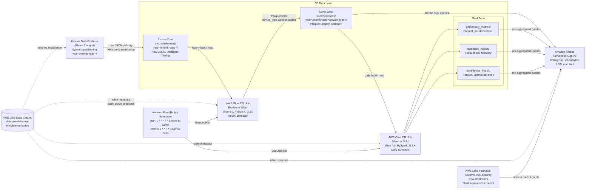

## Data Lake — Cold-Path Analytical Tier

This section documents the cold-path S3 Data Lake that receives raw IoT telemetry from Kinesis Data Firehose and transforms it through a medallion architecture (Bronze → Silver → Gold) into AI-ready Parquet format for analytical queries via Amazon Athena. The cold path complements Phase 2's hot processing path: where Phase 2 routes telemetry to Timestream for operational dashboards, Phase 3 archives every record durably in S3 for historical analytics, reporting, and future ML workloads.

**Integration point:** Kinesis Data Firehose (documented in `04-data-pipeline-processing.md`) delivers raw JSON telemetry to the Bronze S3 prefix at `s3://data-lake/bronze/`. Phase 3 documents everything from Bronze onward — ETL transformation, partitioning, catalog registration, and query access.

See `04-data-pipeline-processing.md` for the Firehose delivery stream configuration that feeds the Bronze zone.

---

## 1. Medallion Zone Inventory

The Data Lake uses a three-zone medallion architecture within a single S3 bucket, separated by prefix. Each zone has a distinct quality guarantee and a registered table in AWS Glue Data Catalog under the `datalake` database. This ensures consistent schema discovery for Athena, Glue ETL jobs, and Firehose Parquet conversion.

| Zone | S3 Prefix | Format | Partition Keys | Written By | Storage Class | Glue Catalog Table |
|------|-----------|--------|----------------|------------|---------------|--------------------|
| Bronze | `s3://data-lake/bronze/telemetry/year=/month=/day=/` | Raw JSON (NDJSON) | year, month, day | Kinesis Data Firehose (Phase 2) | S3 Intelligent-Tiering | `datalake.bronze_telemetry` |
| Silver | `s3://data-lake/silver/telemetry/year=/month=/day=/device_type=/` | Parquet (Snappy) | year, month, day, device_type | Glue ETL (Bronze→Silver) | S3 Standard | `datalake.silver_telemetry` |
| Gold — Hourly Metrics | `s3://data-lake/gold/hourly_metrics/year=/month=/day=/device_type=/` | Parquet (Snappy) | year, month, day, device_type | Glue ETL (Silver→Gold) | S3 Standard | `datalake.gold_hourly_metrics` |
| Gold — Daily Rollups | `s3://data-lake/gold/daily_rollups/year=/month=/day=/` | Parquet (Snappy) | year, month, day | Glue ETL (Silver→Gold) | S3 Standard | `datalake.gold_daily_rollups` |
| Gold — Device Health | `s3://data-lake/gold/device_health/year=/month=/day=/` | Parquet (Snappy) | year, month, day | Glue ETL (Silver→Gold) | S3 Standard | `datalake.gold_device_health` |

### Zone Descriptions

**Bronze — Immutable Landing Zone**

Raw JSON records as delivered by Kinesis Data Firehose. Bronze objects are never modified after the Firehose write — this zone is the audit trail and replay source. If a downstream Glue ETL job has a bug, re-running the Bronze→Silver job on the same Bronze data produces a corrected Silver zone without data loss. S3 Intelligent-Tiering automatically moves Bronze data to cheaper tiers after 30 days — appropriate for write-once, rarely-read raw records.

**Silver — Schema-Validated Parquet**

Cleaned, typed, and deduplicated Parquet produced by the Bronze→Silver Glue ETL job. Transformations applied during this step: null `thingName` record removal, Unix epoch `ts` field cast to UTC ISO-8601 `event_time`, `temperature` and `humidity` enforced as `double`, extraction of `device_type` for partition key, and deduplication of late-arriving records by `(thingName, ts)`. Silver is the primary source for Athena analytical queries — all ad-hoc and API-backed historical queries run against Silver, not Bronze.

**Gold — Pre-Computed Aggregates**

Three Gold sub-zones optimized for dashboard and reporting access patterns, where re-aggregating Silver on every query would be expensive:

- `hourly_metrics/` — average, minimum, and maximum sensor values per device per hour. Enables dashboard time-series panels without scanning all Silver records.
- `daily_rollups/` — per-device-type fleet summary statistics by day. Enables fleet-health dashboards.
- `device_health/` — last-seen timestamp and uptime percentage per device. Enables device connectivity status views.

All Gold zones registered in Glue Data Catalog as separate tables under the `datalake` database for unified query access via Athena.

---

## 2. Complete Cold-Path Data Flow Diagram



**Data flow summary:**

1. Kinesis Data Firehose (Phase 2) delivers raw JSON telemetry with dynamic partitioning to the Bronze zone.
2. EventBridge Scheduler triggers the Bronze→Silver Glue ETL job hourly to process the previous hour's data.
3. The Bronze→Silver job reads Bronze via Glue Data Catalog (with push_down_predicate for date partition), applies schema enforcement and deduplication, and writes Parquet to Silver with `device_type` partitioning added.
4. EventBridge Scheduler triggers the Silver→Gold Glue ETL job daily to compute pre-aggregated Gold tables.
5. Athena queries Silver (for ad-hoc analysis) and Gold (for dashboard-backed API queries) via the Glue Data Catalog. Lake Formation enforces column-level security before queries reach S3.

---

## 3. ETL Pipeline Configuration

### 3a. Bronze→Silver Glue Job

The Bronze→Silver job runs every hour to transform the previous hour's raw JSON records into schema-enforced, deduplicated Parquet in the Silver zone. It is the most critical ETL step — data quality problems in Silver propagate to Gold and all Athena queries.

| Parameter | Value | Rationale |
|-----------|-------|-----------|
| Glue Version | 4.0 | Spark 3.3, Python 3.10. Latest stable. |
| Worker Type | G.1X | 4 vCPU, 16 GB RAM per worker. Sufficient for hourly IoT batches at thousands-of-devices scale. |
| Auto-scaling | Enabled | Glue auto-scaling adjusts worker count dynamically. Avoids over-provisioning for variable batch sizes. |
| IAM Role | `glue-etl-role` | s3:GetObject (bronze prefix), s3:PutObject (silver prefix), glue:UpdateTable (catalog), kms:Decrypt/Encrypt |
| Schedule | Hourly (`0 * * * ? *`) via EventBridge Scheduler | Processes previous hour's Bronze data. |
| Input | Glue Catalog `datalake.bronze_telemetry` | Read via DynamicFrame with push_down_predicate for date partition. |
| Output | Glue Catalog `datalake.silver_telemetry` | Write Parquet (Snappy) with partitionKeys=["year","month","day","device_type"]. |

**Transformation steps (Bronze→Silver):**

1. Read Bronze JSON via Glue DynamicFrame from `datalake.bronze_telemetry` with push_down_predicate for the target hour's partition.
2. Apply schema: cast `ts` (Unix epoch) to UTC ISO-8601 `event_time`, enforce `temperature`/`humidity` as `double`, drop null `thingName` records.
3. Extract `device_type` from DynamoDB device-metadata lookup (or from embedded field if populated at ingest time by Firehose transformation Lambda).
4. Deduplicate late-arriving records: drop records where `(thingName, ts)` already exists in Silver partition (idempotent writes).
5. Write to Silver with `partitionKeys=["year","month","day","device_type"]` in Parquet/Snappy format.
6. Register new partitions via explicit `ALTER TABLE datalake.silver_telemetry ADD IF NOT EXISTS PARTITION (year='2024', month='03', day='15', device_type='temperature-sensor') LOCATION '...'`

**PySpark pseudo-code:**

```python
# Source: AWS Glue Developer Guide — GlueContext.create_dynamic_frame
datasource = glueContext.create_dynamic_frame.from_catalog(
    database="datalake", table_name="bronze_telemetry",
    push_down_predicate="year='2024' and month='03' and day='15'"
)
# Schema enforcement
mapped = ApplyMapping.apply(datasource, mappings=[
    ("ts", "long", "event_time", "timestamp"),
    ("temperature", "double", "temperature", "double"),
    ("thingName", "string", "thing_name", "string"),
    ("deviceType", "string", "device_type", "string"),
])
# Write Silver
glueContext.write_dynamic_frame.from_options(
    frame=mapped,
    connection_type="s3",
    connection_options={
        "path": "s3://data-lake/silver/telemetry/",
        "partitionKeys": ["year", "month", "day", "device_type"]
    },
    format="parquet", format_options={"compression": "snappy"}
)
```

### 3b. Silver→Gold Glue Job

The Silver→Gold job runs daily to compute pre-aggregated Gold tables from the previous day's Silver data. It is scheduled daily because Gold serves dashboard queries where pre-aggregation eliminates expensive per-request aggregation against Silver.

| Parameter | Value | Rationale |
|-----------|-------|-----------|
| Glue Version | 4.0 | Same as Bronze→Silver for consistency. |
| Worker Type | G.1X | Sufficient for daily Silver scan at thousands-of-devices scale. |
| Auto-scaling | Enabled | Volume varies by number of active devices per day. |
| Schedule | Daily at 02:00 UTC (`0 2 * * ? *`) via EventBridge Scheduler | 2 AM UTC gives Bronze→Silver (hourly) time to complete the previous day's final batch before aggregation. |
| Input | Glue Catalog `datalake.silver_telemetry` | Read prior day's Silver partitions. |
| Output | Three Gold tables | `datalake.gold_hourly_metrics` (AVG/MIN/MAX per device per hour), `datalake.gold_daily_rollups` (fleet summary per device_type per day), `datalake.gold_device_health` (last-seen timestamp, uptime percentage per device). |

### 3c. Partition Registration: Explicit vs Crawler

After each Glue ETL job writes new Parquet partitions to S3, the Glue Data Catalog must be updated so Athena can discover the new partitions. Two approaches exist:

| Approach | Speed | Cost | Risk | Recommendation |
|----------|-------|------|------|----------------|
| Explicit partition registration in ETL job | Immediate (within job) | Zero extra cost | Schema must match exactly | **Recommended** — deterministic, zero DPU overhead |
| Glue Crawler after ETL | Minutes delay | ~$0.44/DPU-hour per crawl | Schema drift possible; crawler overwrites custom types | Acceptable for schema discovery; avoid for scheduled production ETL |

For this architecture, explicit `ALTER TABLE ... ADD IF NOT EXISTS PARTITION` statements within the Glue ETL job are used. The IoT telemetry schema is known and stable — no schema discovery is needed after initial setup. Crawlers add DPU cost per run and can overwrite manually defined column types if the JSON source evolves unexpectedly.

### 3d. ETL Trigger Mechanism Comparison

Three trigger mechanisms were evaluated for invoking Glue ETL jobs on a schedule:

| Trigger Mechanism | Latency | Complexity | Cost | Best For |
|-------------------|---------|------------|------|----------|
| EventBridge Scheduler cron | Up to 1 hour (hourly schedule) | Low — no extra services | $1/million schedule invocations | **Recommended:** predictable, batch-oriented, hourly IoT telemetry |
| S3 Event → Lambda → Glue StartJobRun | Minutes after Firehose flush | Medium — Lambda + IAM + event routing | Lambda invocation cost per S3 PUT | When near-real-time transformation is required |
| Glue Workflow + Glue Triggers | Batch-aligned with Glue | Medium — Glue-native but tightly coupled | Included in Glue | When multi-step ETL with dependencies must be visualized in Glue console |

**Why EventBridge Scheduler was selected:**

Amazon EventBridge Scheduler (not EventBridge Rules) is decoupled from Glue internals, supports timezone-aware cron expressions, has a built-in retry policy and dead-letter queue (DLQ) for failed `glue:StartJobRun` calls, and is observable via CloudWatch Events without a custom Lambda. For IoT telemetry that arrives hourly, up-to-one-hour ETL latency is acceptable — devices connect hourly, so data is already one hour old at arrival. Event-driven triggers (S3 → Lambda → Glue) would improve latency to minutes but add a Lambda function, additional IAM roles, and S3 event routing complexity with no material benefit to the analytics use case.

---

## 4. Partitioning Strategy

### 4a. Hive-Style Partition Scheme

All Silver and Gold zones use Hive-style partition keys encoded in S3 prefixes. This enables Athena partition pruning — Athena reads only the S3 objects that match the WHERE clause partition filters, skipping all others.

**Partition key selection: `device_type` not `device_id`**

Partitioning by `device_id` would create thousands of partition directories — one per device. At IoT scale (thousands of devices), this creates the small-file problem: each partition file is tiny (few KB), Glue and Athena pay per S3 LIST call (expensive for thousands of directories), and query planning overhead increases with partition count. By partitioning on `device_type` (typically 3–10 distinct values for an IoT fleet), the partition tree remains shallow and each partition file reaches a performant size (>128 MB Parquet files).

**Concrete S3 path examples:**

```
s3://data-lake/bronze/telemetry/year=2024/month=03/day=15/          (raw JSON from Firehose)
s3://data-lake/silver/telemetry/year=2024/month=03/day=15/device_type=temperature-sensor/part-0001.parquet
s3://data-lake/gold/hourly_metrics/year=2024/month=03/day=15/device_type=temperature-sensor/part-0001.parquet
```

### 4b. Firehose Dynamic Partitioning

Kinesis Data Firehose writes Bronze data using dynamic partitioning, producing Hive-style `year=/month=/day=/` prefixes from the record's timestamp field. This is configured in the Firehose delivery stream (Phase 2) using a Firehose dynamic partition expression. The `device_type` partition key is **not** present in Bronze — it is added by the Bronze→Silver Glue ETL job, which extracts `device_type` from the DynamoDB device-metadata table during schema enforcement.

This separation is intentional: Firehose writes at high throughput with minimal transformation; device-type enrichment (a DynamoDB lookup) is done in the ETL job where Spark parallelism amortizes the lookup cost across the entire batch.

### 4c. Cost Reduction Example

The following scenario uses 1,000 devices publishing hourly, with three device types (temperature-sensor, pressure-sensor, humidity-sensor), generating approximately 100 GB of Silver Parquet per month.

| Query Scope | Data Scanned | Athena Cost ($5/TB) |
|-------------|-------------|---------------------|
| Full table scan (no partitioning) | 100 GB/month | $0.50 |
| Full table scan at 1 year | 1.2 TB | $6.00 |
| One device_type, one month (partitioned) | 2.5% of monthly = 2.5 GB | $0.013 |
| One device_type, one day (partitioned) | ~83 MB | less than $0.001 |

**Dollar illustration:** Querying one device type for one month scans ~2.5% of data vs 100% for an unpartitioned layout. At $5/TB scanned, this turns a $5.00 query into a $0.13 query.

The compounding effect is significant at scale: a report covering all 12 months for one device type scans 2.5% × 1.2 TB = 30 GB vs 1.2 TB full scan — the difference between $0.15 and $6.00 for the same report output.

---

## 5. Athena Query Layer

Amazon Athena is the serverless SQL query engine for ad-hoc and API-backed queries on the Data Lake. Athena integrates natively with the Glue Data Catalog, reading table schemas and partition locations registered by the Glue ETL jobs.

### 5a. Why Silver and Gold Only — Never Bronze

Athena queries Silver and Gold Parquet zones exclusively. Bronze JSON is never queried via Athena for two reasons:

1. **No columnar optimization:** JSON has no predicate pushdown or column pruning. A Bronze query selecting only the `temperature` field must scan every byte of every record — all fields, all records in the matching time range.
2. **No partition pruning on device_type:** Bronze has no `device_type` partition. A device-type-filtered query against Bronze scans all device types.

**Cost comparison — same query, different zones:**

```
Query: SELECT AVG(temperature) FROM telemetry WHERE device_type = 'temperature-sensor' AND year='2024' AND month='03'

Bronze (raw JSON, no device_type partition):  Scans 100% of March data = 200 GB → $1.00
Silver (Parquet, device_type partitioned):    Scans device_type partition + temperature column only = 5 GB → $0.025
```

The Silver query costs 40× less than the Bronze query for the same analytical result.

### 5b. Athena Workgroup Configuration

All platform users and API Lambda functions query through the `iot-analytics` Athena Workgroup. Workgroup settings are enforced server-side and cannot be overridden by client configuration.

| Setting | Value | Purpose |
|---------|-------|---------|
| BytesScannedCutoffPerQuery | 1 GB (1,073,741,824 bytes) | Hard stop on runaway full-table scans — protects against unintentional Bronze-scale scans |
| ResultsLocation | `s3://data-lake/athena-results/` | Dedicated results bucket with 7-day lifecycle policy (auto-delete old results) |
| EnforceWorkGroupConfiguration | true | Prevents client-side overrides — all users subject to the 1 GB cutoff and results location |
| EngineVersion | Athena engine version 3 | Latest. SQL syntax improvements, better Parquet read performance via vectorized reader. |

The 1 GB cutoff prevents a misconfigured query from scanning the full year Silver table (1.2 TB at 1,000 devices). A well-partitioned query targeting one device_type and one day (~83 MB) is well within budget.

### 5c. Athena vs Redshift Spectrum vs EMR Comparison

| Service | Best For | Pros | Cons | Cost Model | Recommendation |
|---------|----------|------|------|------------|----------------|
| Amazon Athena | Ad-hoc SQL queries on well-partitioned Parquet Data Lake | Serverless, zero infrastructure, pay-per-query, native Glue Catalog integration | Not suitable for sub-second latency or high-concurrency dashboards | $5/TB scanned (Parquet + partitioning reduces this 80-90%) | **Recommended** for this architecture — ad-hoc analytics on IoT telemetry Data Lake |
| Amazon Redshift Spectrum | Consistent high-volume queries with a resident Redshift cluster | Leverages existing Redshift compute, concurrent query scaling, result caching | Requires a running Redshift cluster ($0.25/hour minimum), adds operational overhead | Redshift cluster cost + $5/TB scanned on S3 | Consider if query volume grows beyond Athena's per-query pricing model |
| Amazon EMR (Spark SQL) | Complex ML/ETL pipelines beyond SQL, custom Spark applications | Full Spark ecosystem, notebook support (EMR Studio), custom UDFs | Cluster management (even with managed scaling), higher minimum cost | EC2 instance hours + EMR premium | Consider only for complex ML workloads that exceed Athena's SQL capabilities |

For this IoT platform, Athena is the clear choice. The Data Lake receives hourly device telemetry from thousands of devices — query patterns are ad-hoc analytical queries run by operators and data engineers, not high-concurrency dashboard queries. The well-partitioned Parquet format in Silver/Gold zones ensures Athena scans minimal data per query.

### 5d. Example Athena Queries

The following queries illustrate typical IoT Data Lake use cases using the registered Glue Catalog tables. All queries target Silver or Gold — never Bronze.

```sql
-- Average temperature by device type for the last 7 days (queries Gold)
SELECT device_type, AVG(avg_temperature) as fleet_avg
FROM datalake.gold_hourly_metrics
WHERE year = '2024' AND month = '03' AND day BETWEEN '08' AND '15'
GROUP BY device_type;

-- Raw telemetry for a specific device type on a specific day (queries Silver)
SELECT thing_name, event_time, temperature, humidity
FROM datalake.silver_telemetry
WHERE year = '2024' AND month = '03' AND day = '15'
  AND device_type = 'temperature-sensor'
ORDER BY event_time DESC
LIMIT 100;

-- Device health check: last-seen and daily uptime (queries Gold)
SELECT thing_name, last_seen_time, uptime_pct
FROM datalake.gold_device_health
WHERE year = '2024' AND month = '03' AND day = '15'
ORDER BY uptime_pct ASC
LIMIT 20;
```

Both queries use partition keys in the `WHERE` clause — Athena's engine prunes all non-matching S3 partitions before reading any data. The Gold query scans only pre-aggregated rows; the Silver query scans typed Parquet columns, not raw JSON fields.

---

## 6. Lake Formation Access Control

AWS Lake Formation provides fine-grained access control over the Data Lake, governing multi-team access beyond what raw S3 bucket policies can express. Lake Formation applies column-level security (restricting which columns a team can query) and row-level filters (restricting which partitions or rows a team can access) before any query reaches S3.

**Example use cases:**
- A maintenance team can query `device_health` Gold data but cannot access raw telemetry in Silver.
- An analytics team can query all Silver columns except `thing_name` (PII masking via column-level grant exclusion).
- A per-tenant operator sees only devices in their facility (row-level filter on a tenant partition key).

Lake Formation intercepts Athena and Glue queries at the AWS service layer, enforcing access before the query reaches S3. This is more granular than S3 bucket policies, which can only control access at the object/prefix level. For multi-team environments, Lake Formation is the recommended access control plane — a single governance layer replaces per-table per-IAM-role S3 bucket policy combinations.

### Access Model

| Access Type | Mechanism | Example |
|-------------|-----------|---------|
| Column-level security | Lake Formation column grant | Analytics team: all columns. API Lambda: temperature, humidity, device_type, event_time only (no internal fields). |
| Row-level filters | Lake Formation data filter | Per-tenant isolation: operator A sees only devices in their facility. |
| Table-level access | Lake Formation database/table grant | Data engineering team: full `datalake` database access. Dashboard Lambda: `silver_telemetry` and `gold_*` tables only. |

Lake Formation intercepts all Athena and Glue queries at the AWS service layer. S3 bucket policies do not need to be modified per user — the Lake Formation grants are the single access control plane.

### IAM Roles with Lake Formation Grants

| Role | Lake Formation Permission | Purpose |
|------|--------------------------|---------|
| `glue-etl-role` | SUPER on `datalake` database | ETL jobs read Bronze and write Silver/Gold |
| `api-lambda-role` | SELECT on `silver_telemetry` (filtered columns) | Dashboard API queries on Silver |
| `analytics-role` | SELECT on all `datalake` tables | Data engineering team — full analytical access |
| `firehose-delivery-role` | No Lake Formation grant needed | Firehose writes directly to S3 via IAM; catalog registration is via Glue job |

---

## Design Notes and Anti-Patterns

> **Anti-Pattern 1 — Never query Bronze via Athena.** Never query Bronze via Athena for analytical workloads. Bronze JSON has no columnar optimization. Every query scans every byte. A Bronze query costs 8–10× more than the equivalent Silver Parquet query. Use `BytesScannedCutoffPerQuery` as a safety net, and restrict Athena access to Silver and Gold tables via Lake Formation grants.

> **Anti-Pattern 2 — Never partition by device_id.** Never partition by `device_id`. Thousands of device-specific partitions create the small-file problem. Each partition produces tiny files. Glue and Athena pay per S3 LIST call, and small files degrade query performance. Partition by `device_type` (3–10 values) not `device_id` (thousands).

> **Anti-Pattern 3 — Never write ETL output to Bronze.** Never write ETL output to Bronze. Bronze is the immutable audit trail and replay source. Enforce via S3 bucket policy: deny `s3:PutObject` on the `bronze/` prefix for the Glue ETL IAM role. The ETL role should have `s3:GetObject` on Bronze and `s3:PutObject` on Silver only.

> **Anti-Pattern 4 — Never rely solely on Glue Crawler for schema management.** Crawlers can introduce schema drift when new fields appear. For a known, stable IoT telemetry schema, define the Glue Catalog table schema explicitly. Use Crawlers only for initial schema discovery, not for scheduled production partition management.

> **Anti-Pattern 5 — Always configure Glue job failure alerting.** Always configure Glue job failure alerting. Glue jobs that fail silently leave Silver/Gold stale. Configure a CloudWatch Alarm on the Glue job `Failed` metric and route to SNS for operator notification. A failed Bronze→Silver job at 01:00 UTC means the 02:00 UTC Silver→Gold job runs on yesterday's Gold — silent staleness.

> **Anti-Pattern 6 — Always create Glue Catalog table before Firehose Parquet conversion.** Always create the Glue Catalog table before enabling Firehose Parquet conversion. Firehose Parquet conversion requires a pre-existing Glue Catalog table. Without it, Firehose silently falls back to JSON delivery. This is a setup ordering requirement: create the `datalake.bronze_telemetry` Glue Catalog table first, then enable Parquet conversion in the Firehose delivery stream configuration.

---

## Cross-References

| Component | Documented In | Relationship to Data Lake |
|-----------|---------------|--------------------------|
| Kinesis Data Firehose (Bronze feeder) | `04-data-pipeline-processing.md` | Phase 2 output — Firehose delivers raw JSON to Bronze zone with dynamic partitioning |
| S3 VPC Gateway Endpoint | `01-security-foundation.md` | Glue jobs in VPC private subnets access S3 via Gateway endpoint (free, no internet traversal) |
| KMS encryption | `01-security-foundation.md` | All S3 zones use CMK encryption (SEC-04). Glue IAM role has kms:Decrypt/Encrypt permissions. |
| DynamoDB device-metadata | `05-storage-layer.md` | Bronze→Silver job enriches device_type from the DynamoDB `device-metadata` table |
| Timestream (hot path) | `05-storage-layer.md` | Parallel hot path for operational dashboards; Data Lake is the complementary cold path for historical analytics |
