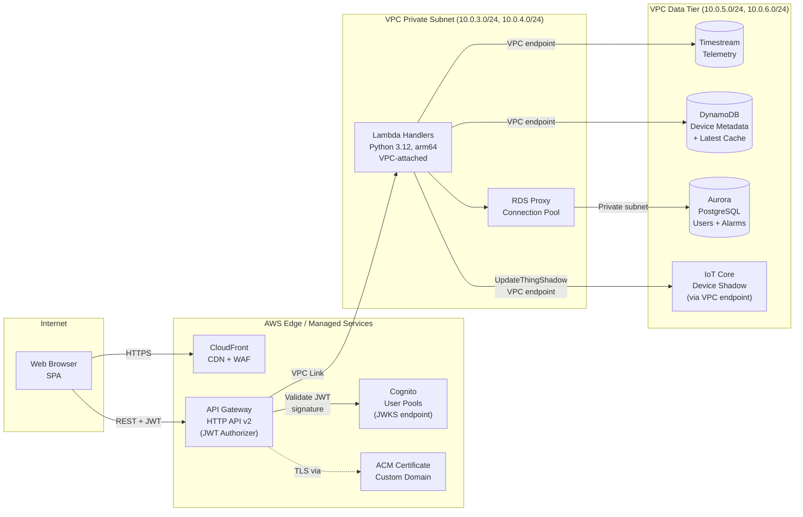
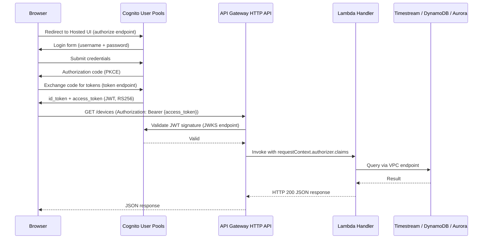

## API Layer

The REST API layer is the interface between the web SPA and all backend services in the IoT monitoring platform. It exposes structured HTTP endpoints that allow the frontend to query time-series telemetry from Timestream, retrieve device metadata from DynamoDB, manage users and alert rules in Aurora, and send commands to devices via IoT Device Shadow — all through a single, secured API surface.

The layer is **entirely serverless**: Amazon API Gateway HTTP API v2 acts as the managed front door, routing authenticated requests to AWS Lambda handlers deployed in VPC private subnets. Lambda handlers connect to data stores exclusively through VPC endpoints — no storage service has a public endpoint. Amazon RDS Proxy mediates all Lambda → Aurora connections to prevent connection pool exhaustion.

Authentication is delegated to Amazon Cognito User Pools, which issues JWTs validated at the gateway level before any Lambda invocation. This design means Lambda handlers never handle unauthenticated requests — authorization is enforced structurally, not by handler code.

> **Cross-references:** See [01-security-foundation.md](01-security-foundation.md) for VPC topology, subnet inventory, and VPC endpoints. See [05-storage-layer.md](05-storage-layer.md) for Timestream, DynamoDB, and Aurora configuration details.

---

### API Gateway HTTP API v2

**Decision D-04 | D-05**

Amazon API Gateway HTTP API (v2) was selected as the REST API front door. Key configuration points:

**Cost and performance advantage:** HTTP API v2 costs $1.00 per million requests — 70% cheaper than REST API v1 ($3.50/M). It also has a lower internal latency overhead (~10 ms vs ~30 ms for v1). At IoT platform scale, this cost difference compounds quickly.

**Native JWT authorizer:** HTTP API v2 supports a built-in JWT authorizer that validates Cognito-issued JWTs directly — no custom Lambda authorizer required. The authorizer verifies the token signature against Cognito's JWKS endpoint and checks `aud` (audience) and `iss` (issuer) claims.

JWT authorizer configuration (CloudFormation / SAM excerpt):

```yaml
Auth:
  DefaultAuthorizer: CognitoJWTAuthorizer
  Authorizers:
    CognitoJWTAuthorizer:
      IdentitySource: $request.header.Authorization
      JwtConfiguration:
        Audience:
          - !Ref CognitoUserPoolClientId
        Issuer: !Sub "https://cognito-idp.${AWS::Region}.amazonaws.com/${CognitoUserPoolId}"
```

**Custom domain with ACM:** The API is served under a custom domain (e.g., `api.iot-platform.example.com`) with a TLS certificate provisioned by AWS Certificate Manager (ACM). ACM auto-renews certificates — zero certificate management overhead.

**VPC Link for private Lambda targets:** API Gateway uses a VPC Link to route requests to Lambda functions in private subnets (`10.0.3.0/24` and `10.0.4.0/24` from doc 01). Lambda handlers have no public endpoint — they are only reachable through the VPC Link.

---

### API Endpoints

**Decision D-02**

Endpoints are grouped by resource domain. This table documents representative endpoints — not an exhaustive API specification. Each endpoint shows the backing storage tier that serves the request.

| Resource Group | Method | Endpoint | Backend Storage | Description |
|----------------|--------|----------|-----------------|-------------|
| Devices | GET | `/devices` | DynamoDB | List all registered devices with metadata (device ID, type, location, last-seen timestamp) |
| Devices | GET | `/devices/{thingName}` | DynamoDB | Retrieve device detail: metadata, current config, last-reported values, shadow state |
| Devices | POST | `/devices/{thingName}/commands` | IoT Device Shadow | Send command to device — updates `desired` state in Device Shadow; device receives delta on next reconnect |
| Telemetry | GET | `/devices/{thingName}/telemetry` | Timestream | Query time-series data for a device — accepts `startTime`, `endTime`, `metrics`, `aggregation` parameters |
| Telemetry | GET | `/telemetry/latest` | DynamoDB | Latest reported values for all devices — served from the DynamoDB latest-value cache for sub-millisecond response |
| Alarms | GET | `/alarms` | Aurora (via RDS Proxy) | List active and historical alarms with filters: device, severity, time range, acknowledgement status |
| Alarms | PUT | `/alarms/{alarmId}/acknowledge` | Aurora (via RDS Proxy) | Acknowledge an alarm — records operator ID, timestamp, and optional note in the relational alarm table |
| Users/Auth | POST | `/auth/token` | Cognito (proxy) | Token refresh endpoint — proxies to Cognito token endpoint; returns new `access_token` for expired sessions |
| Users/Auth | GET | `/users/me` | Aurora (via RDS Proxy) | Retrieve current user profile, assigned roles, device group access permissions |

**Routing note:** IoT Device Shadow commands (`POST /devices/{thingName}/commands`) are the only endpoint that writes to IoT Core — not to a storage tier. The Lambda handler calls the IoT Data Plane API (`UpdateThingShadow`) to set the `desired` state. The device receives the command as a shadow delta when it reconnects. See [03-device-management.md](03-device-management.md) for the Device Shadow delta flow.

---

### API Layer Architecture Diagram



---

### Authentication Flow

**Decision D-03 | D-13**

The following sequence shows the complete Cognito Hosted UI PKCE (Proof Key for Code Exchange) authentication flow, from browser login through to an authenticated API call and data retrieval.



> **Security note:** API Gateway's built-in JWT authorizer eliminates the need for a custom Lambda authorizer. Auth is enforced at the gateway level — a misconfigured Lambda handler cannot accidentally serve unauthenticated requests. The Lambda function receives claims already validated; it can extract the `sub` (user ID) and `cognito:groups` claims directly from `event.requestContext.authorizer.claims` without performing any signature verification itself.

---

### API Front Door Comparison

**Decision D-04**

| Criterion | API Gateway HTTP API v2 | API Gateway REST API v1 | AWS App Runner |
|-----------|------------------------|------------------------|----------------|
| **Cost** | $1.00/M requests | $3.50/M requests | ~$6–7/month base + compute |
| **JWT Authorizer** | Native (built-in, zero code) | Custom Lambda authorizer required | Custom middleware in application code |
| **VPC Integration** | VPC Link to NLB/Lambda | VPC Link to NLB | VPC Connector |
| **Usage Plans / API Keys** | Not supported | Supported | Not supported |
| **Request Validation** | Not supported natively | Supported via request models | Application code |
| **Latency overhead** | Lower (~10 ms) | Higher (~30 ms) | Container cold start (few seconds) |
| **WebSocket support** | Not supported | Supported | Not supported |
| **Idle cost** | $0 (pay per request) | $0 (pay per request) | ~$6–7/month base even at zero traffic |
| **Recommendation** | **Selected** — 70% cheaper than v1, native JWT authorizer removes Lambda authorizer boilerplate, no idle cost, sufficient features for this IoT platform | Use only if per-client usage plans, API keys for third-party billing, or WebSocket support are required | Use for containerized APIs with consistent high-concurrency traffic where Lambda cold starts are unacceptable (e.g., >100 req/sec steady state) |

---

### Auth Provider Comparison

**Decision D-14**

| Criterion | Cognito User Pools | IAM Identity Center | Self-managed IdP (e.g., Keycloak) |
|-----------|-------------------|--------------------|------------------------------------|
| **Primary use case** | Application user authentication (operators, dashboard users, admins) | Workforce / employee access to AWS console and accounts | Full control over auth flows and user attributes |
| **JWT issuance** | Native — issues `id_token` + `access_token` (RS256 JWTs) | SAML 2.0 assertions (not JWTs directly — requires translation layer) | Depends on implementation (OpenID Connect capable) |
| **API Gateway integration** | Native JWT authorizer — zero additional code | Requires Lambda authorizer to translate SAML → claims | Requires Lambda authorizer with custom OIDC/SAML handling |
| **MFA support** | Built-in (SMS OTP, TOTP, email OTP) | Built-in | Self-managed |
| **Social / federated login** | Supported (Google, Facebook, SAML IdP, OIDC) | Supported (Active Directory, external IdPs) | Supported, but self-configured |
| **Hosted UI** | Yes — Cognito Hosted UI with custom branding | AWS access portal | Self-hosted |
| **Operational overhead** | Fully managed — zero infrastructure | Fully managed — zero infrastructure | Self-hosted infrastructure, patching, HA |
| **Cost** | Free up to 50,000 MAU; $0.0055/MAU above | Free for AWS account access | Infrastructure + operations cost |
| **Recommendation** | **Selected** — purpose-built for application user authentication. Native API Gateway JWT authorizer integration eliminates a Lambda authorizer and reduces latency. Managed service with zero ops burden. | Use as a SAML 2.0 IdP federated with Cognito User Pools if corporate SSO (Active Directory / Okta) is required — Cognito still issues the JWTs consumed by API Gateway. | Avoid — self-hosted infrastructure directly contradicts the serverless, managed architecture chosen throughout this platform. Ops overhead not justified for this use case. |

---

### Design Notes

**RDS Proxy is mandatory for Lambda → Aurora connections.**
Lambda scales horizontally — each concurrent execution opens a new database connection. Aurora Serverless v2 at minimum capacity (0.5 ACU) supports approximately 90 `max_connections`. With only 90 concurrent Lambda executions, the connection pool is exhausted and subsequent requests fail with `too many connections`. RDS Proxy multiplexes thousands of Lambda connections into a small, stable pool of database connections. This is the #1 production failure mode for the Lambda → Aurora pattern without a proxy. See [05-storage-layer.md](05-storage-layer.md) for Aurora configuration details.

**Lambda runtime: Python 3.12 on arm64 (Graviton2).**
Graviton2 Lambda is approximately 20% cheaper and delivers ~19% better performance per dollar compared to x86_64. No code changes required for Python. Enable via `Architectures: [arm64]` in the function configuration.

**Lambda timeout: 29 seconds maximum for API-Gateway-integrated functions.**
API Gateway HTTP API enforces a hard 29-second integration timeout. Lambda functions must complete within this window or the gateway returns a 504. For data-heavy queries (e.g., large Timestream time-range scans), pagination must be implemented — never fetch unbounded result sets in a single Lambda invocation.

**Cold start mitigation.**
For this platform's expected traffic pattern (moderate, bursty), Lambda cold starts are acceptable. If specific endpoints have strict latency SLAs (< 100 ms p99), Provisioned Concurrency can be enabled selectively. Do not enable Provisioned Concurrency platform-wide — it eliminates the zero-idle-cost advantage of Lambda.

**Cognito Identity Pools: optional pattern for direct frontend-to-AWS access.**
Cognito Identity Pools can grant authenticated web users temporary IAM credentials scoped to specific AWS permissions — enabling the browser to query Timestream or S3 directly, without proxying through Lambda. This is not the primary pattern in this architecture: API-mediated access through Lambda provides a consistent authorization enforcement point, complete audit log (CloudWatch Logs), and the ability to add business logic (rate limiting, data filtering, tenant isolation) without frontend changes. Use Cognito Identity Pools only if direct-to-service latency is critical and the additional IAM scoping complexity is acceptable.

**Cross-references:**
- VPC topology, private subnets, and VPC endpoint configuration: [01-security-foundation.md](01-security-foundation.md)
- Timestream, DynamoDB, and Aurora Serverless v2 configuration: [05-storage-layer.md](05-storage-layer.md)
- IoT Device Shadow for command delivery (used by `POST /devices/{thingName}/commands`): [03-device-management.md](03-device-management.md)
- Lambda processing patterns and batch configuration: [04-data-pipeline-processing.md](04-data-pipeline-processing.md)
