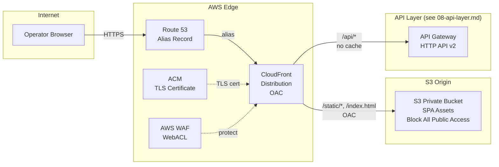
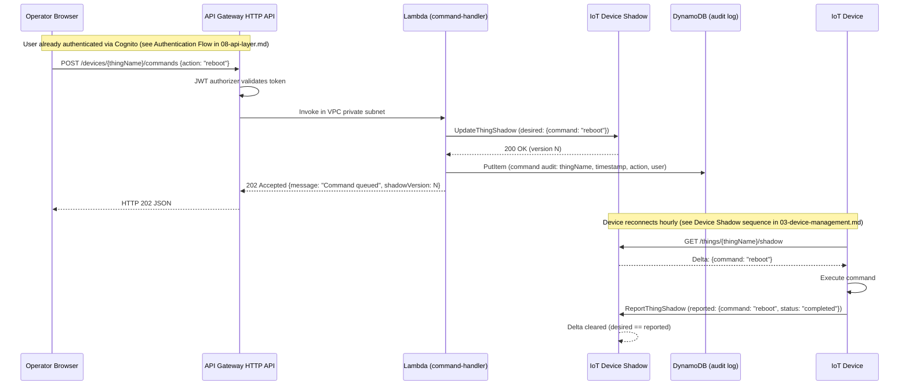

## Web Frontend

The web frontend is the browser-based dashboard that IoT platform operators use to monitor device telemetry, manage devices, view and acknowledge alarms, and send commands to devices. It is a static JavaScript single-page application (SPA) — the choice of framework (React, Vue, Angular) is an implementation detail outside the architecture scope. The SPA is hosted on Amazon S3, served exclusively through Amazon CloudFront with Origin Access Control (OAC) enforcing that no client can bypass the CDN to hit S3 directly. AWS WAF protects the CloudFront distribution at the edge. All dynamic data comes from the REST API documented in [08-api-layer.md](08-api-layer.md) — the frontend never accesses storage services directly.

> **Cross-references:** See [01-security-foundation.md](01-security-foundation.md) for WAF rules and VPC topology. See [03-device-management.md](03-device-management.md) for the Device Shadow delta sequence. See [08-api-layer.md](08-api-layer.md) for API endpoints and Cognito authentication flow.

---

### SPA Hosting Architecture

**Decision D-06 | D-07**

The SPA hosting stack is composed of four AWS services working together:

**S3 Private Bucket — SPA asset store:**
The built SPA (HTML, JavaScript bundles, CSS, images) is stored in an S3 bucket with **Block All Public Access** enabled. No bucket policy grants public read access. The bucket is not configured for static website hosting (the endpoint is not needed — CloudFront is the only access path). Assets are versioned via content-addressed filenames (e.g., `main.a1b2c3.js`) to enable long cache TTLs without stale-asset problems.

**CloudFront Distribution — CDN and sole origin gateway:**
A CloudFront distribution serves as the only access path to S3. Requests for `/index.html` and SPA assets hit CloudFront first. CloudFront fetches from S3 using Origin Access Control (OAC) — a signed request mechanism that authenticates CloudFront to S3 using the `cloudfront.amazonaws.com` service principal. Requests for `/api/*` paths are forwarded without caching to the API Gateway HTTP API (documented in [08-api-layer.md](08-api-layer.md)).

**ACM Certificate — HTTPS on custom domain:**
An ACM certificate covers `*.iot-platform.example.com`, provisioned in `us-east-1` (required for CloudFront — ACM certificates for CloudFront must be in us-east-1). The certificate auto-renews — zero certificate management overhead. The same wildcard certificate covers both `dashboard.iot-platform.example.com` (this distribution) and `api.iot-platform.example.com` (API Gateway custom domain, per D-05 in [08-api-layer.md](08-api-layer.md)).

**Route 53 — DNS resolution:**
A Route 53 alias record in the hosted zone for `iot-platform.example.com` points `dashboard.iot-platform.example.com` to the CloudFront distribution. Alias records are free (unlike CNAME records) and support zone apex resolution.

**WAF WebACL — Edge protection:**
An AWS WAF WebACL is attached to the CloudFront distribution. The WAF rules applied are the same rules documented in [01-security-foundation.md](01-security-foundation.md) under SEC-06: rate limiting, SQL injection protection, XSS protection, and optional geo-blocking. A single WebACL can protect both the CloudFront distribution (frontend) and the API Gateway stage (API) simultaneously — no duplication of rule configuration required.

---

### Origin Access Control

**Decision D-07 | Requirement WEB-03**

CloudFront Origin Access Control (OAC) is the current AWS-recommended mechanism for restricting S3 bucket access to a specific CloudFront distribution only. OAC replaced the legacy Origin Access Identity (OAI) as the GA standard in August 2022.

**Key difference from legacy OAI:**
OAI used a `CanonicalUser` principal in the S3 bucket policy — a CloudFront-specific virtual identity. OAC uses the standard `cloudfront.amazonaws.com` **Service** principal with an `AWS:SourceArn` condition scoped to the specific distribution ARN. This aligns with the standard AWS service-principal pattern and supports all S3 encryption configurations including SSE-KMS (OAI does not support SSE-KMS).

**S3 Bucket Policy with OAC:**

```json
{
  "Version": "2012-10-17",
  "Statement": [
    {
      "Sid": "AllowCloudFrontOAC",
      "Effect": "Allow",
      "Principal": { "Service": "cloudfront.amazonaws.com" },
      "Action": "s3:GetObject",
      "Resource": "arn:aws:s3:::iot-dashboard-spa/*",
      "Condition": {
        "StringEquals": {
          "AWS:SourceArn": "arn:aws:cloudfront::123456789012:distribution/EXAMPLEID"
        }
      }
    }
  ]
}
```

> Replace `iot-dashboard-spa`, `123456789012`, and `EXAMPLEID` with actual values. The key difference from legacy OAI: OAC uses the `Service` principal instead of a `CanonicalUser` principal.

**What this achieves:** The `AWS:SourceArn` condition restricts the permission to the specific CloudFront distribution only. Even if another distribution in another account were to target this bucket, the request would be denied — the policy is scoped to one distribution, not to all CloudFront globally.

---

### CloudFront Cache Behaviors

Cache behaviors are evaluated in order, most specific first. The `/api/*` path pattern routes to the API Gateway origin without caching:

| Path Pattern | Origin | Cache TTL | Notes |
|---|---|---|---|
| `/index.html` | S3 (OAC) | Short (60s) | SPA entry point — must reflect deployments quickly |
| `/static/*` | S3 (OAC) | Long (1 year) | Hashed filenames (e.g., `main.a1b2c3.js`) — immutable |
| `/api/*` | API Gateway HTTP API | No cache (forward all) | Dynamic data — Authorization header forwarded |
| Default (`*`) | S3 (OAC) | Medium (1 hour) | Other assets (images, fonts) |

The short TTL on `/index.html` (60 seconds) ensures that after a new SPA deployment, users receive the updated HTML shell — which references the new hashed static bundles — within one minute. Static bundles use 1-year TTLs because their content-addressed filenames guarantee that any change produces a new URL.

---

### Web Frontend Architecture Diagram

**Decision D-11**



---

### Web-to-Device Command Flow

**Decision D-08 | Requirement WEB-02**

The following sequence diagram shows the complete end-to-end command delivery lifecycle — from an operator clicking a button in the browser dashboard to the command being applied on the IoT device. This diagram intentionally spans two phases of the architecture to illustrate how the API layer and the Device Shadow pattern work together.



The first half (Browser → Shadow update) is the API-layer contribution documented here. The second half (Device reconnects → delta apply → reported update) is the Device Shadow pattern documented in [03-device-management.md](03-device-management.md). Together, they form the complete web-to-device command delivery lifecycle required by DEVM-02.

**Why 202 Accepted and not 200 OK:**
The command is queued in Device Shadow, not yet executed on the device. Returning 202 Accepted accurately communicates the asynchronous nature of the operation — the device may not execute the command for up to one hour (its next reconnect window). The `shadowVersion` in the response allows the frontend to later poll the shadow state and detect when `reported.command` matches `desired.command` (delta cleared), confirming delivery.

---

### Web Hosting Comparison

**Decision D-06 | Requirement WEB-01**

| Criterion | SPA on S3 + CloudFront | Amazon Managed Grafana | AWS Amplify Hosting |
|---|---|---|---|
| Use Case | Custom IoT dashboard with device command UI | Operations-only monitoring (time-series visualization) | Developer-friendly SPA deployment |
| Customization | Full control (custom components, command flows, branding) | Limited to Grafana plugins and panels | Full control (wraps S3 + CloudFront) |
| Device Commands | Yes — custom UI → API → Device Shadow | No — Grafana is read-only visualization | Yes — same as S3 + CloudFront |
| Data Sources | Any (via REST API) | Direct Timestream, CloudWatch, DynamoDB plugins | Any (via REST API) |
| Authentication | Cognito User Pools (JWT) | AWS IAM / SAML / Cognito Identity Pools | Cognito User Pools |
| Cost | S3 + CloudFront (~$1–5/month) | $9/editor/month + $5/viewer/month | S3 + CloudFront + CI/CD (~$1–5/month + build minutes) |
| CI/CD | Manual or custom pipeline | Not applicable (managed) | Built-in (branch previews, auto-deploy) |
| Infrastructure Visibility | Explicit (shows S3, CloudFront, OAC) — ideal for architecture assessment | Abstracted (managed service) | Abstracted (wraps S3 + CF) |
| **Recommendation** | **Selected** — custom dashboards, device commands, architecture transparency for assessment | Best for ops-only teams needing quick Timestream dashboards without custom UI | Consider for production deployments where CI/CD convenience > architecture transparency |

**Why not Grafana:** Grafana cannot send write commands to devices — it is a visualization-only tool. The platform requirement includes device command delivery from the UI, which requires a custom frontend capable of calling `POST /devices/{thingName}/commands`. Grafana cannot fulfill this requirement without custom plugin development, which removes its simplicity advantage.

**Why not Amplify Hosting:** AWS Amplify Hosting wraps S3 + CloudFront with a developer-friendly CI/CD pipeline, branch previews, and environment variable management. It is architecturally equivalent to the selected approach but abstracts the underlying components. For this technical assessment, explicitly naming S3, CloudFront, OAC, and ACM demonstrates architecture competence that would be obscured by the Amplify abstraction. In a production team context with active CI/CD requirements, Amplify Hosting is a valid — and often preferred — choice.

---

### Design Notes

**WAF WebACL — Cross-reference to 01-security-foundation.md:**
The WAF WebACL attached to the CloudFront distribution applies the rules documented under SEC-06 in [01-security-foundation.md](01-security-foundation.md): rate limiting (prevents DDoS and credential stuffing), AWS Managed Rules for SQL injection and XSS protection, and optional geo-blocking rules. The same WebACL can be shared across both the CloudFront distribution and the API Gateway stage — no duplication required. See [01-security-foundation.md](01-security-foundation.md) for the full rule inventory.

**SPA client-side routing:**
A React/Vue SPA handles routing on the client side using the HTML5 History API (e.g., `/devices/abc123` is handled by the SPA router, not a server). CloudFront must be configured with a custom error response to support this: HTTP 403 and 404 responses from S3 (which occur when CloudFront requests a path like `/devices/abc123` that does not exist as an S3 object) should return `/index.html` with HTTP 200 status. This allows the SPA to load and handle the route client-side.

**ACM wildcard certificate:**
A single `*.iot-platform.example.com` ACM wildcard certificate covers both `dashboard.iot-platform.example.com` (this CloudFront distribution) and `api.iot-platform.example.com` (the API Gateway custom domain documented in [08-api-layer.md](08-api-layer.md)). ACM certificates for CloudFront must be provisioned in `us-east-1` regardless of the distribution's edge locations. The same certificate can be reused across multiple CloudFront distributions and API Gateway custom domains in the same account.

**OAC vs OAI — migration note:**
Legacy deployments using Origin Access Identity (OAI) should migrate to OAC. OAC supports SSE-KMS encrypted S3 buckets (OAI does not), supports all S3 APIs (not just GetObject), and uses the standard service principal pattern consistent with other AWS service integrations. The bucket policy change is the only migration step required — the CloudFront distribution configuration change is minimal.
