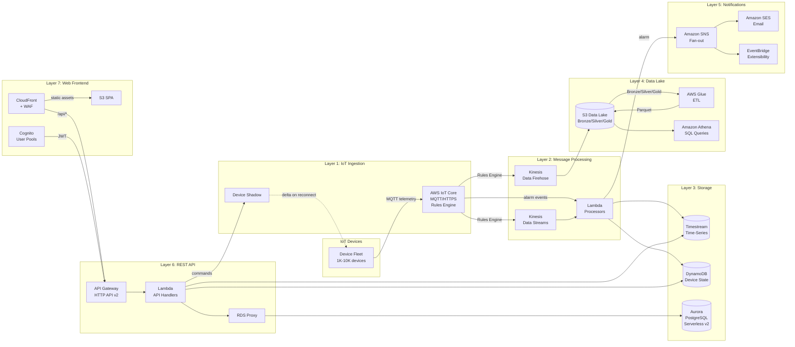
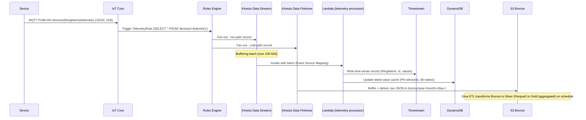
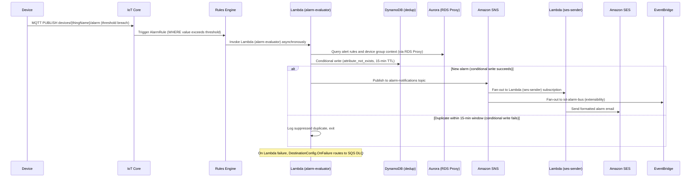
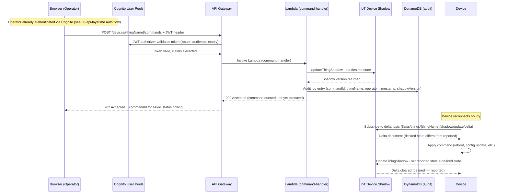

## Architecture Overview

This document provides the 30,000-foot view of the IoT monitoring platform architecture, followed by end-to-end sequence diagrams for the three key operational flows. Each component is documented in detail in its per-layer document (01–09). This overview shows how all layers connect.

---

### System Architecture Overview

#### Per-Layer Document Reference

| Layer | Per-Layer Document | Key Components |
|-------|-------------------|----------------|
| Security Foundation | [01-security-foundation.md](01-security-foundation.md) | VPC, IAM, KMS, WAF |
| IoT Ingestion | [02-device-connectivity-ingestion.md](02-device-connectivity-ingestion.md) | IoT Core, Rules Engine, Basic Ingest |
| Device Management | [03-device-management.md](03-device-management.md) | Device Shadow, Fleet Provisioning |
| Message Processing | [04-data-pipeline-processing.md](04-data-pipeline-processing.md) | Kinesis Data Streams, Lambda batch consumer |
| Storage | [05-storage-layer.md](05-storage-layer.md) | Timestream, DynamoDB, Aurora Serverless v2 |
| Alarm Notifications | [06-alarm-notifications.md](06-alarm-notifications.md) | SNS, SES, EventBridge, deduplication |
| Data Lake & ETL | [07-data-lake-etl.md](07-data-lake-etl.md) | S3 Medallion, Glue ETL, Athena |
| REST API | [08-api-layer.md](08-api-layer.md) | API Gateway HTTP API v2, Cognito, Lambda |
| Web Frontend | [09-web-frontend.md](09-web-frontend.md) | CloudFront, S3 OAC, SPA |

---

### Telemetry Ingestion Flow

This sequence covers the end-to-end path of a telemetry message from device publish to storage in both the operational hot store (Timestream) and the analytical cold store (S3 Data Lake).

> See [02-device-connectivity-ingestion.md](02-device-connectivity-ingestion.md) for IoT Core and Rules Engine configuration.
> See [04-data-pipeline-processing.md](04-data-pipeline-processing.md) for Kinesis and Lambda batch processing.
> See [05-storage-layer.md](05-storage-layer.md) for Timestream and DynamoDB storage design.
> See [07-data-lake-etl.md](07-data-lake-etl.md) for the Data Lake cold path (Glue ETL and Athena).

---

### Alarm Notification Flow

This sequence covers the path from a device reporting a threshold breach to an email notification reaching the operator, including deduplication to prevent notification storms.

> See [02-device-connectivity-ingestion.md](02-device-connectivity-ingestion.md) for IoT Rules Engine.
> See [06-alarm-notifications.md](06-alarm-notifications.md) for the full alarm pipeline, deduplication strategy, and EventBridge extensibility.

---

### Command Delivery Flow

This sequence covers the full end-to-end path of an operator sending a command from the web dashboard to a normally-disconnected device. The command is queued in IoT Device Shadow and delivered when the device next connects.

> See [08-api-layer.md](08-api-layer.md) for Cognito authentication and API Gateway configuration.
> See [03-device-management.md](03-device-management.md) for the Device Shadow delta mechanism and shadow document structure.
> See [09-web-frontend.md](09-web-frontend.md) for the SPA hosting architecture and operator dashboard.

---

### Technology Decision Summary

This table provides a single-page view of all major technology decisions across the architecture. Each comparison table is located in its per-layer document with full pros/cons analysis.

| Decision | Alternatives Compared | Recommendation | Document |
|----------|-----------------------|----------------|----------|
| IoT Entry Point | IoT Core vs SiteWise vs self-managed MQTT | AWS IoT Core | [02-device-connectivity-ingestion.md](02-device-connectivity-ingestion.md) |
| Stream Buffer | Kinesis Data Streams vs MSK vs SQS | Kinesis Data Streams | [04-data-pipeline-processing.md](04-data-pipeline-processing.md) |
| Time-Series Store | Timestream vs DynamoDB-TS vs InfluxDB | Amazon Timestream | [05-storage-layer.md](05-storage-layer.md) |
| Relational Store | Aurora Serverless v2 vs RDS Provisioned vs DynamoDB-only | Aurora PostgreSQL Serverless v2 | [05-storage-layer.md](05-storage-layer.md) |
| ETL Trigger | EventBridge Scheduler vs S3-event-driven vs Glue Workflow | EventBridge Scheduler | [07-data-lake-etl.md](07-data-lake-etl.md) |
| Query Engine | Athena vs Redshift Spectrum vs EMR | Amazon Athena | [07-data-lake-etl.md](07-data-lake-etl.md) |
| API Front Door | HTTP API v2 vs REST API v1 vs App Runner | API Gateway HTTP API v2 | [08-api-layer.md](08-api-layer.md) |
| Auth Provider | Cognito User Pools vs IAM Identity Center vs self-managed | Amazon Cognito User Pools | [08-api-layer.md](08-api-layer.md) |
| Web Hosting | S3+CloudFront vs Managed Grafana vs Amplify Hosting | S3 + CloudFront | [09-web-frontend.md](09-web-frontend.md) |

> Each comparison table is located in its per-layer document with full pros/cons analysis. This summary provides a single-page view for evaluators. Per D-15, tables are referenced here, not duplicated.
